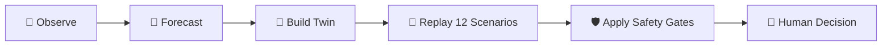
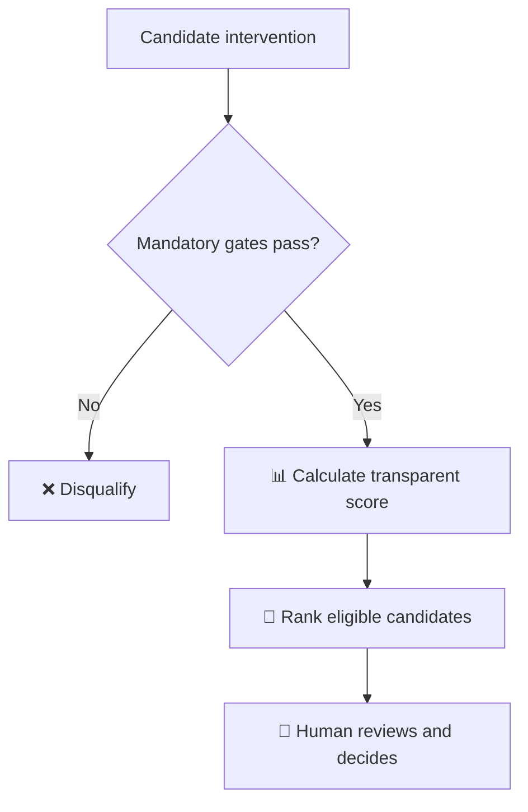
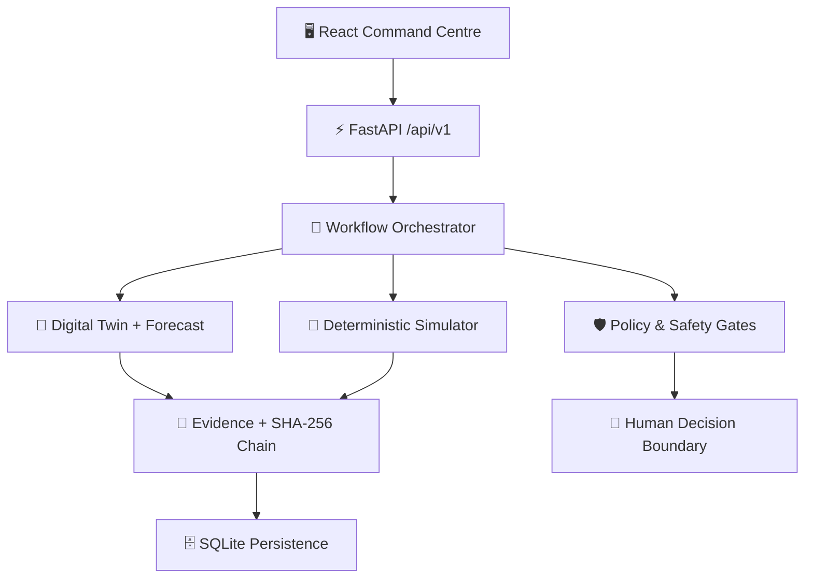
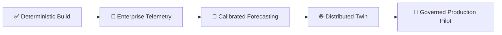

<p align="center">
  
</p>

<h1 align="center">🛰️ SentinelOps Nexus</h1>

<p align="center">
  <strong>The Enterprise Operational Digital Twin</strong><br/>
  Predict tomorrow’s operational bottleneck <em>before</em> customers experience it.
</p>

<p align="center">
  
  
  
  
  
  
  
</p>

<p align="center">
  <a href="https://janicebenita-sentinelops-nexus.onrender.com"><strong>Open Live Demo</strong></a> ·
  <a href="#-quick-start"><strong>Quick Start</strong></a> ·
  <a href="#-architecture"><strong>Architecture</strong></a> ·
  <a href="#-guided-judge-demo"><strong>Judge Demo</strong></a> ·
  <a href="#-safety-by-design"><strong>Safety</strong></a> ·
  <a href="#-evaluation-evidence"><strong>Evidence</strong></a>
</p>

> [!IMPORTANT]
> **Working-build status:** The complete deterministic local workflow is validated without paid credentials.  
> **Safety boundary:** Approval records a human decision and unlocks evidence export. It never deploys, changes infrastructure, or executes a production action.

---

## 🏆 Competition Mission

**National AI Agent Builder Finale · B2B Services · Late Bottleneck Detection**

Traditional monitoring tells an operations team that a threshold **has already failed**. SentinelOps Nexus asks the question that matters earlier:

> **Which constraint will become the next bottleneck, when will customers feel it, and which intervention remains safe under nearby failure conditions?**

Nexus turns telemetry into a traceable decision workflow:



This is not another alert dashboard. It is a bounded, reproducible operational decision system that predicts, tests, rejects unsafe options, explains its reasoning, and stops at the human-control boundary.

---

## ✨ Why SentinelOps Nexus Stands Out

| Capability | What the operator receives | Why it matters |
|---|---|---|
| 🔭 Early bottleneck forecast | Safe-capacity crossing and likely customer-impact window | Moves response from reactive to preventive |
| 🧬 Bounded Digital Twin | Immutable, content-hashed operational model | Makes every replay traceable and comparable |
| 🧪 Deterministic scenario lab | 12 reproducible failure and intervention scenarios | Produces judge-verifiable evidence |
| 🏟️ Intervention tournament | FAST, SAFE, and OPTIMAL compared on the same Twin | Prevents recommendation by intuition alone |
| 🛡️ Mandatory safety gates | Unsafe candidates are disqualified regardless of score | Makes safety a rule, not a suggestion |
| 💰 Explainable business impact | Visible equations, assumptions, and exposure estimates | Connects engineering risk to business decisions |
| 👤 Human-governed approval | Named decision, rationale, and audit record | Preserves accountability and control |
| 📦 Evidence export | Verifiable ZIP with hashes, scenarios, decisions, and audit events | Supports review, compliance, and reproducibility |

---

## 🎯 Canonical Evaluation Story

The seeded **Payment Service** begins healthy while traffic and Redis memory pressure rise. Nexus:

1. detects the weak early signal;
2. forecasts Redis safe-capacity crossing at **+30 minutes**;
3. estimates customer impact at **+45 minutes** under documented assumptions;
4. creates a hashed, bounded Digital Twin;
5. replays **12 deterministic scenarios** with the same manifest and seed;
6. evaluates three interventions;
7. rejects the plausible **FAST** fix because it fails mandatory failover safety;
8. recommends the highest-scoring eligible strategy—currently **OPTIMAL**;
9. estimates business exposure using visible inputs and equations; and
10. stops for a named human decision—without executing any production action.

### Evaluation evidence

| Judge question | Evidence-backed answer |
|---|---|
| What bottleneck is emerging? | Redis saturation on the Payment Service critical path |
| When is safe capacity crossed? | **+30 minutes** in the canonical deterministic seed |
| When may customers be affected? | **+45 minutes**, subject to displayed assumptions |
| How many scenarios are replayed? | **12**, using the same Twin manifest and random seed |
| Which false fix is detected? | **FAST**, rejected by the mandatory failover safety gate |
| Which strategy is recommended? | Highest-scoring eligible candidate; currently **OPTIMAL** |
| Is confidence a probability? | No—it is a heuristic evidence score |
| Is revenue exposure guaranteed? | No—it is an operational estimate from visible inputs |
| Does approval deploy anything? | No—it records a human decision and enables evidence export |

---

## 🛡️ Intervention Decision Matrix

| Intervention | Intent | Mandatory gates | Eligible | Decision |
|---|---|---:|:---:|---|
| ⚡ **FAST** | Scale application replicas immediately | ❌ Failover safety fails | **No** | Disqualified regardless of score |
| 🛟 **SAFE** | Redis capacity + controlled failover + traffic shaping | ✅ Pass | **Yes** | Lower-cost eligible alternative |
| 🎯 **OPTIMAL** | Redis capacity + cache-policy correction + gradual scaling | ✅ Pass | **Yes** | Recommended by transparent score |

> [!CAUTION]
> **Eligibility overrides score.** A failed mandatory gate can never be outweighed by confidence, predicted benefit, or business value.



---

## 🎬 Guided Judge Demo

The command centre provides two complementary experiences from the mode switcher.

### ▶️ One-click Guided Demo

A six-stop, auto-playing tour presents:

- early signal detection;
- transparent forecasting;
- bounded Digital Twin creation;
- deterministic scenario replay;
- false-fix rejection; and
- the human decision boundary.

The tour can be paused, moved backward or forward, or exited at any time. It **never presses the approval button**.

**[Launch the live command centre →](https://janicebenita-sentinelops-nexus.onrender.com)**

### 🎛️ Explore Mode

Operators can change four bounded inputs:

- traffic;
- Redis capacity;
- application replicas; and
- dependency latency.

They can also load presets or upload operational JSON, persist a workflow, replay all 12 backend-calculated scenarios, and inspect each scenario’s inputs, recovery, outcome, evidence references, and deterministic hash.

Use `docs/sample-explore-controls.json` to exercise the upload workflow. Uploaded evidence is content-hashed and added to the backend audit chain.

> [!NOTE]
> **Rerun = simulation only. Approval = decision recording only.** The interface keeps `PRODUCTION ACTION: NOT EXECUTED` visible throughout.

### Recommended five-minute judging route

| Time | Demonstrate | Proof point |
|---:|---|---|
| 0:00–0:40 | Mission and rising Redis pressure | Healthy-now does not mean safe-next |
| 0:40–1:20 | +30 and +45 forecast | Early warning precedes reactive alert |
| 1:20–2:05 | Twin manifest and hash | Model boundary and evidence are explicit |
| 2:05–3:15 | Twelve-scenario replay | Results are deterministic and inspectable |
| 3:15–4:10 | FAST rejection and OPTIMAL selection | Safety gates override score |
| 4:10–5:00 | Human decision and export boundary | Governance is built into the workflow |

---

## 🏗️ Architecture



The Digital Twin is a **bounded operational model under documented assumptions**, not a claim of perfect production replication.

### Yesterday → Now → Tomorrow

The command centre exposes five canonical points: **Yesterday**, **Now**, **+15**, **+30**, and **+45 minutes**.

Forecast calculations remain deterministic and visible:

```text
memory_pct(t) = current_memory_pct + saturation_slope × minutes

threshold_crossing =
    (safe_threshold - current_memory_pct) / saturation_slope
```

The UI exposes the method, threshold, residual MAE, error bound, assumptions, and linked evidence IDs.

### Twelve deterministic scenarios

| # | Scenario | # | Scenario |
|---:|---|---:|---|
| 01 | Baseline growth | 07 | Reduced Redis capacity |
| 02 | Redis crash | 08 | Increased application replicas |
| 03 | Redis latency | 09 | Rollback |
| 04 | Replica failover | 10 | Rate limiting |
| 05 | 10× traffic | 11 | Cache-policy correction |
| 06 | One-million-user stress | 12 | Configuration drift |

Every result includes inputs, status, p95 latency, error rate, recovery estimate, evidence references, and a deterministic SHA-256 hash.

---

## 🔐 Safety by Design

Only backend policy can change workflow state. The provider/model cannot approve a recommendation.

Human approval means exactly three things:

1. record the named human decision and rationale;
2. append the decision to the chained audit timeline; and
3. permit export of the evidence package.

It **never** means deployment or production execution.

The evidence ZIP contains the incident, Twin manifest, source evidence, forecast, scenarios, tournament results, verification results, business-impact estimate, executive brief, audit events, and `manifest.sha256`.

---

## 🧰 Technology Stack

| Layer | Technology |
|---|---|
| Backend | Python 3.11+, FastAPI, Pydantic v2, SQLAlchemy |
| Persistence | SQLite for deterministic local/demo operation |
| Frontend | React 18, TypeScript, Vite, TanStack Query, Recharts |
| Quality | Pytest, Ruff, MyPy, Bandit, Vitest |
| Delivery | Docker Compose, Render Blueprint |
| Provider | Deterministic local provider by default; no paid key required |
| Optional AI | Gemini/OpenAI narrative adapter boundary |

---

## 🚀 Quick Start

### Prerequisites

- Python **3.11+**
- Node.js **20+**
- pnpm

### Windows PowerShell

```powershell
python -m venv .venv
& ".\.venv\Scripts\python.exe" -m pip install -e ".[dev]"

Set-Location frontend
pnpm install
Set-Location ..

& ".\.venv\Scripts\python.exe" -m uvicorn backend.app.main:app --reload --port 8000
```

In a second terminal:

```powershell
Set-Location frontend
pnpm dev
```

### Linux or macOS

```bash
python3 -m venv .venv
./.venv/bin/python -m pip install -e '.[dev]'

cd frontend
pnpm install
cd ..

./.venv/bin/python -m uvicorn backend.app.main:app --reload --port 8000
```

In a second terminal:

```bash
cd frontend
pnpm dev
```

Open:

- 🖥️ Command centre: `http://localhost:5173`
- 📚 Interactive API documentation: `http://localhost:8000/docs`

---

## ✅ Validation and Reproducibility

### Backend and end-to-end checks

```powershell
& ".\.venv\Scripts\python.exe" -m pytest backend\tests demo_app\tests -q
& ".\.venv\Scripts\python.exe" -m ruff check backend demo_app scripts
& ".\.venv\Scripts\python.exe" -m mypy backend demo_app scripts
& ".\.venv\Scripts\python.exe" -m bandit -q -lll -r backend demo_app scripts
& ".\.venv\Scripts\python.exe" scripts\nexus_e2e.py
```

### Frontend checks

```bash
cd frontend
pnpm test
pnpm run build
```

Determinism is part of the product contract: the same Twin manifest, seed, controls, and scenario definition produce the same inspectable outcome hash.

---

## 🎥 Narrated Walkthrough

The reproducible generator renders a synchronized nine-scene Nexus simulation as a 1080p H.264/AAC walkthrough with SRT captions and professional Indian-English narration. The final approval control is never activated.

```powershell
& ".\.venv\Scripts\python.exe" scripts\generate_storytelling_video.py --install
```

Generated artifacts include the submission-ready MP4, synchronized captions, `voice.wav`, and intermediate recordings. Lossless voice and intermediate browser recordings remain gitignored build outputs.

- 🎞️ [Narrated demo video](demo_storytelling_video.mp4) — submission-ready MP4, validated at 4:50
- 💬 [Synchronized captions](demo_storytelling_video.srt)

> [!NOTE]
> The default narration uses Microsoft `en-IN-NeerjaNeural`. Narration text is sent to Microsoft Edge TTS when the generator runs; use it only where that external processing is acceptable.

---

## 📈 Implementation Status

| Layer | Status |
|---|---|
| Deterministic local provider and seeded workflow | ✅ Implemented and tested |
| FastAPI `/api/v1`, SQLite persistence, SSE audit events | ✅ Implemented and tested |
| React command centre backed by persisted API data | ✅ Implemented and tested |
| Digital Twin, scenarios, tournament, impact, and export | ✅ Implemented and tested |
| Optional Gemini/OpenAI narrative adapters | 🟡 Adapter boundary exists; not required for demo |
| Google ADK, A2A, and MCP enterprise connectors | 🔭 Production evolution |
| Vertex AI, Pub/Sub, Spanner Graph, BigQuery ML, Looker | 🔭 Research architecture; not active in this build |

---

## ☁️ Deployment Notes

| Live resource | Link |
|---|---|
| 🖥️ Command centre | [Open SentinelOps Nexus](https://janicebenita-sentinelops-nexus.onrender.com) |
| ⚡ Versioned API | [Check API health](https://janicebenita-sentinelops-nexus-api.onrender.com/api/v1/health) |
| 🧪 Simulator | [Check simulator health](https://janicebenita-sentinelops-nexus-simulator.onrender.com/health) |
| 🚀 Render deployment | [Open deployed application](https://janicebenita-sentinelops-nexus.onrender.com/) |

`render.yaml` defines three independent Nexus services:

- `janicebenita-sentinelops-nexus`
- `janicebenita-sentinelops-nexus-api`
- `janicebenita-sentinelops-nexus-simulator`

Render free services may cold-start. SQLite storage is ephemeral in that environment; reset and replay are intentionally deterministic. PostgreSQL is recommended for durable production operation.

---

## ⚖️ Honest Limitations

- Included telemetry is deterministic seeded demonstration data, not a live enterprise feed.
- The forecast is a transparent bounded linear model, not a calibrated predictive probability.
- Simulation covers documented variables and is not a complete production replica.
- Business-impact outputs are estimates, not accounting results or guaranteed savings.
- Enterprise connectors and Google-scale services in the research architecture are not active integrations in this build.
- The frontend bundle currently produces a non-blocking Vite chunk-size warning.

Transparent limitations strengthen the evidence: judges can distinguish what is **working now**, what is **bounded by design**, and what belongs to the production roadmap.

---

## 📚 Documentation

| Guide | Purpose |
|---|---|
| [Product Requirements](docs/PRD.md) | Complete requirements, acceptance criteria, and product boundaries |
| [Architecture](docs/architecture.md) | Components, boundaries, and data flow |
| [API](docs/api.md) | Versioned endpoints and contracts |
| [Guided Product Demo](docs/demo-script.md) | Reproducible judge walkthrough |
| [Evaluation](docs/evaluation.md) | Claims, metrics, and supporting evidence |
| [Safety](docs/safety.md) | Mandatory gates and human-control boundary |
| [Limitations](docs/limitations.md) | Explicit scope and non-claims |
| [Evaluation Q&A](docs/judge-qa.md) | Concise responses for judges |
| [Implementation Plan](docs/implementation-plan.md) | Delivery and production-evolution plan |

---

## ❓ Key Technical Q&A

<details>
<summary><strong>How are forecasts produced?</strong></summary>

A transparent bounded linear saturation model exposes its equation, threshold, residual error, error bound, assumptions, and linked evidence.
</details>

<details>
<summary><strong>How are scenarios compared fairly?</strong></summary>

All 12 scenarios use the same immutable Twin manifest and random seed, making results reproducible and comparable.
</details>

<details>
<summary><strong>How are unsafe recommendations blocked?</strong></summary>

Mandatory eligibility gates are evaluated before ranking. A failed gate disqualifies a candidate regardless of its score.
</details>

<details>
<summary><strong>What does approval do?</strong></summary>

It records a named human decision and rationale, adds it to the audit chain, and enables evidence export. It never executes a production action.
</details>

<details>
<summary><strong>Why use deterministic data?</strong></summary>

It lets judges and developers reproduce the complete workflow without paid credentials, unstable external services, or unverifiable outputs.
</details>

---

## 🗺️ Production Evolution



The roadmap preserves the core invariant: **evidence first, safety gates second, human authority always**.

---

## 👩‍💻 Author

Built by **[Janice Benita F](https://github.com/Janicebenita)** for the **National AI Agent Builder Finale**.

Contributions are welcome through focused issues and pull requests. Changes must preserve deterministic gates, evidence traceability, the human approval boundary, and the absence of automatic production execution.

---

<p align="center">
  <strong>Predict early. Simulate safely. Decide with evidence.</strong><br/>
  <sub>SentinelOps Nexus · Enterprise Operational Intelligence with Human Control</sub>
</p>
