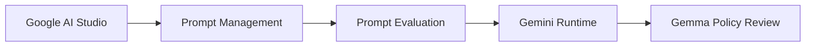

<p align="center">
  
</p>

<h1 align="center">🛡️ SentinelOps Nexus</h1>

<p align="center">
  <strong>The Enterprise Operational Digital Twin</strong>
</p>

<p align="center">
  <em>Predict tomorrow's operational bottleneck before customers experience it.</em>
</p>

<p align="center">
  <a href="https://sentinelops-frontend-398391487181.asia-south1.run.app/">
    
  </a>
  <a href="https://github.com/Janicebenita/SentinelOps-X/actions/workflows/validate.yml">
    
  </a>
  
  
  
</p>

<p align="center">
  
  
  
  
</p>

<p align="center">
  <a href="https://sentinelops-frontend-398391487181.asia-south1.run.app/">
    <strong>🚀 Open Live Product</strong>
  </a>
  ·
  <a href="https://sentinelops-frontend-398391487181.asia-south1.run.app/command-centre">
    <strong>🧭 Command Centre</strong>
  </a>
  ·
  <a href="https://sentinelops-frontend-398391487181.asia-south1.run.app/judge-demo">
    <strong>🎬 Guided Demo</strong>
  </a>
  ·
  <a href="docs/architecture.md">
    <strong>🏗️ Architecture</strong>
  </a>
  ·
  <a href="agent.yaml">
    <strong>🪪 Agent Manifest</strong>
  </a>
  ·
  <a href="SOUL.md">
    <strong>🧠 Agent Soul</strong>
  </a>
</p>

<p align="center">
  <a href="https://sentinelops-frontend-398391487181.asia-south1.run.app/judge-demo">
    
  </a>
</p>

<p align="center">
  <strong>
    Forecast → Digital Twin → Simulation → Gemini Reasoning → Gemma Review → Human Approval → Evidence ZIP
  </strong>
</p>

<p align="center">
  <sub>
    30-second product flow · click the animation to open the interactive backend-driven demo
  </sub>
</p>

> National AI Agent Builder Finale submission for the B2B Services challenge:
> **Late Bottleneck Detection**.

> [!IMPORTANT]
> ## PRODUCTION ACTION: NOT EXECUTED
>
> Approval records a governed human decision and enables evidence export.
>
> It does **not** deploy, scale, roll back, reconfigure, or modify production
> infrastructure.

---

## ⚡ SentinelOps Nexus in 30 Seconds

SentinelOps Nexus is a **human-governed enterprise operational intelligence
agent system** designed to detect emerging operational bottlenecks before
customers experience them.

The platform combines:

- deterministic forecasting;
- a bounded Operational Digital Twin;
- reproducible scenario simulation;
- intervention optimization;
- evidence-grounded Gemini reasoning;
- Gemma policy review;
- specialized AI agents;
- mandatory safety gates;
- verification;
- governed human decisions; and
- tamper-evident evidence export.

The canonical workflow is:

```text
Operational Telemetry
        ↓
Deterministic Forecast
        ↓
Bounded Digital Twin
        ↓
12 Scenario Replays
        ↓
Intervention Tournament
        ↓
Evidence-Grounded AI Reasoning
        ↓
Policy Review
        ↓
Mandatory Safety Gates
        ↓
Verification
        ↓
AWAITING_HUMAN
        ↓
Authorized Human Decision
        ↓
Audit Chain + Evidence ZIP
```

### Authority principle

> **AI reasons and explains.  
> Deterministic systems establish eligibility.  
> Authorized humans make the governed decision.**

No AI model, agent, tool, or orchestration layer is authorized to execute
production infrastructure changes.

---

## 🪪 GitAgent Passport — Repository-Native Agent Identity

SentinelOps Nexus is structured as a **repository-native collaborative AI
agent system** with explicit identity, responsibilities, operating rules,
authority boundaries, collaboration guidance, and human-governance
constraints.

The GitAgent specification complements the working SentinelOps Nexus
runtime.

It does **not** replace:

- the FastAPI backend;
- deterministic operational intelligence;
- the Digital Twin;
- the simulation engine;
- mandatory safety gates;
- verification;
- backend authorization;
- the AI Workforce;
- the audit chain; or
- the governed human-decision workflow.

### Agent specification

| File | Purpose |
|---|---|
| [`agent.yaml`](agent.yaml) | Machine-readable SentinelOps Nexus agent manifest |
| [`SOUL.md`](SOUL.md) | Mission, identity, philosophy, values, and operating posture |
| [`RULES.md`](RULES.md) | Non-negotiable safety, evidence, and authority boundaries |
| [`DUTIES.md`](DUTIES.md) | Core responsibilities and expected operational behavior |
| [`AGENTS.md`](AGENTS.md) | Multi-agent collaboration and orchestration guidance |

### Primary agent mission

> **Predict emerging operational bottlenecks, evaluate interventions through
> deterministic evidence, coordinate specialized AI agents, and support an
> authorized human decision without autonomously modifying production
> infrastructure.**

### Agent authority boundary

```text
OBSERVE
   ↓
FORECAST
   ↓
MODEL
   ↓
SIMULATE
   ↓
OPTIMIZE
   ↓
REASON
   ↓
REVIEW
   ↓
VERIFY
   ↓
RECOMMEND
   ↓
AWAITING_HUMAN
   ↓
AUTHORIZED HUMAN DECISION
```

The GitAgent definition preserves the permanent SentinelOps Nexus safety
invariant:

> **PRODUCTION ACTION: NOT EXECUTED**

No repository-defined agent is authorized to deploy, scale, roll back,
reconfigure, execute shell commands against, or otherwise modify production
infrastructure.

---

## 🌐 Live Deployment Status

| Environment | Status | Purpose |
|---|---|---|
| Local | `IMPLEMENTED_AND_VERIFIED` | Complete deterministic workflow and reproducible validation |
| Google Cloud Run | `IMPLEMENTED_AND_VERIFIED_LIVE` | Primary live deployment; nine services passed authenticated health and readiness checks |

---

## 🚀 Live Product

- **Primary application:** [Open SentinelOps Nexus on Google Cloud Run](https://sentinelops-frontend-398391487181.asia-south1.run.app/)
- **Command Centre:** [Open the operational workspace](https://sentinelops-frontend-398391487181.asia-south1.run.app/command-centre)
- **Guided product demo:** [Start the deterministic judge workflow](https://sentinelops-frontend-398391487181.asia-south1.run.app/judge-demo)
- Local application: `http://localhost:5173/`
- Local Command Centre: `http://localhost:5173/command-centre`
- Local five-minute evidence workspace: `http://localhost:5173/judge-demo`

Google Cloud Run is the primary live judge-demo environment.

The deployed frontend and API passed direct HTTP, runtime-configuration,
readiness, and browser CORS checks. All nine Cloud Run service health and
readiness endpoints passed the authenticated deployment smoke test.

---

## 🎯 Project Overview

SentinelOps Nexus is an **evidence-driven operational decision-support
product**.

It forecasts emerging Redis saturation, builds a bounded Digital Twin,
replays 12 deterministic scenarios, compares FAST, SAFE, and OPTIMAL
interventions, applies mandatory safety gates, and stops at an authorized
human decision boundary.

The canonical seeded workflow models a **Payment Service** whose Redis
memory pressure rises before a reactive alert fires.

Under the documented deterministic seed, SentinelOps Nexus:

- forecasts the Redis safe-capacity crossing at **+30 minutes**;
- estimates possible customer impact at **+45 minutes**;
- creates a version-locked, content-hashed Digital Twin;
- replays **12 deterministic scenarios**;
- disqualifies FAST when its mandatory failover gate fails;
- recommends the highest-scoring eligible candidate, currently OPTIMAL;
- generates an evidence-grounded executive brief;
- requires a qualified human decision and rationale; and
- exports a verifiable Evidence ZIP with `manifest.sha256`.

The bounded deterministic forecast and mandatory safety gates remain
authoritative.

Model output cannot:

- approve;
- change workflow state;
- override eligibility;
- bypass mandatory gates; or
- execute a production action.

---

## 📊 Enterprise Value

| Enterprise signal | Product evidence |
|---|---|
| Operational foresight | Deterministic Redis safe-capacity forecast before the reactive alert |
| Decision confidence | Twelve reproducible scenarios and a transparent intervention tournament |
| Collaborative intelligence | Specialized agents coordinate through the Nexus Orchestrator |
| AI with bounded authority | Gemini explains; Gemma critiques; deterministic backend gates decide eligibility |
| Human governance | Verified role, mandatory rationale, backend authorization, and no automatic approval |
| Auditability | Evidence references, result hashes, trace context, SHA-256-linked events, and Evidence ZIP |
| Repository-native agent identity | Explicit manifest, identity, rules, duties, and multi-agent collaboration specification |

[Quick Start](#-running-locally) ·
[Architecture](#-architecture-summary) ·
[Agents](#-agent-orchestration) ·
[Guided Demo](#-guided-product-demo) ·
[Safety](#-security-and-human-control) ·
[Evidence](#-evaluation-evidence)

---

## 🏗️ Architecture Summary

<p align="center">
  <a href="docs/assets/sentinelops-nexus-architecture-readable.png">
    
  </a>
</p>

<p align="center">
  <sub>
    <strong>Complete Google-native enterprise architecture</strong>
    · click the board for the full-resolution architecture
  </sub>
</p>


This ordering is a **safety invariant**.

Executive recommendation follows mandatory gates and verification.

Human approval follows verification and the explicit `AWAITING_HUMAN`
state.

The complete architecture is documented in
[docs/architecture.md](docs/architecture.md), presented interactively at
`/architecture`, and summarized in the
[high-contrast architecture board](docs/assets/sentinelops-nexus-architecture-readable.png).

---

## 🤖 Agent Orchestration

SentinelOps Nexus is not implemented as a single general-purpose chatbot.

It uses a specialized **AI Workforce** coordinated through the
**Nexus Orchestrator**.

### AI Workforce

The workforce includes:

1. **Nexus Orchestrator**
2. **Observer Agent**
3. **Evidence Agent**
4. **Process Discovery Agent**
5. **Prediction Agent**
6. **Digital Twin Agent**
7. **Simulation Agent**
8. **Optimization Agent**
9. **Verification Agent**
10. **Business Impact Agent**
11. **Executive Agent**

Conceptually:

```text
                         NEXUS ORCHESTRATOR
                                │
          ┌─────────────────────┼─────────────────────┐
          │                     │                     │
          ▼                     ▼                     ▼
      OBSERVER               EVIDENCE             PREDICTION
          │                     │                     │
          ▼                     ▼                     ▼
 PROCESS DISCOVERY        DIGITAL TWIN            SIMULATION
          │                     │                     │
          └─────────────────────┼─────────────────────┘
                                ▼
                         OPTIMIZATION
                                │
                                ▼
                         VERIFICATION
                                │
                                ▼
                       BUSINESS IMPACT
                                │
                                ▼
                           EXECUTIVE
                                │
                                ▼
                     MANDATORY CONTROLS
                                │
                                ▼
                        AWAITING_HUMAN
                                │
                                ▼
                     AUTHORIZED HUMAN
```

The current AI Workforce uses an **ADK-compatible orchestration boundary
and agent registry**.

The official Google ADK runtime has not yet been verified in the
authenticated environment, so its current status remains:

```text
LOCAL_ADAPTER_ONLY
```

The orchestration boundary coordinates structured agent execution and
Agent-to-Agent handoffs while the backend retains workflow authority.

Every visible agent card is clickable and opens a backend-driven workspace.

Supported run and rerun actions persist:

- status;
- duration;
- retry count;
- inputs;
- outputs;
- evidence references;
- result hashes; and
- audit events.

Typed A2A messages carry:

- workflow metadata;
- task metadata;
- correlation metadata;
- causation metadata;
- artifact references;
- evidence references;
- status; and
- trace metadata.

Hidden chain-of-thought is not persisted.

---

## 🧠 Google AI Lifecycle and Authority

SentinelOps Nexus follows the Google-native AI engineering lifecycle:



### 1. Google AI Studio

Google AI Studio is the prompt-development and evaluation workspace, not the
production runtime.

It supports iterative design of evidence-grounded tasks before approved
prompt assets enter version control.

The repository does not claim a verified Studio session without
authenticated session evidence.

### 2. Prompt Management

Version-controlled assets under:

```text
prompts/gemini/
prompts/gemma/
prompts/schemas/
prompts/evaluations/
```

define:

- prompt IDs;
- versions;
- CRISPE context;
- evidence inputs;
- allowed tools;
- prohibited actions;
- refusal conditions;
- strict output schemas; and
- bounded fallbacks.

### 3. Prompt Evaluation

Automated schema and evaluation tests check:

- expected evidence references;
- structured outputs;
- safety refusals;
- deterministic-authority boundaries; and
- prohibited approval or production behavior.

### 4. Gemini Enterprise Agent Platform Runtime

Gemini Enterprise Agent Platform, formerly Vertex AI, is the primary AI
reasoning runtime in the Google-native architecture.

When Google credentials are configured, it provides:

- evidence-grounded reasoning;
- contradiction detection;
- missing-evidence detection;
- scenario explanations;
- candidate explanations;
- recommendation synthesis;
- business-impact explanation; and
- executive summaries.

Gemini output is:

- schema validated;
- evidence referenced;
- hashed;
- traced;
- audited; and
- bounded by deterministic fallback behavior.

Gemini never:

- approves;
- executes production actions;
- bypasses safety gates; or
- directly mutates workflow state.

### 5. Gemma Private Policy Review Engine

The Gemma Private Policy Review Engine provides secondary policy and safety
review for:

- recommendation-to-gate consistency;
- evidence completeness;
- policy-violation classification;
- contradiction review; and
- unsafe-recommendation critique.

Gemma remains advisory.

It cannot override Mandatory Safety Gates, approve, change workflow state,
or execute production actions.

---

## ⚖️ Backend Authority

The FastAPI backend remains authoritative for:

- deterministic forecasts;
- scenario calculations;
- intervention eligibility;
- mandatory safety gates;
- workflow-state transitions;
- role verification;
- approval authorization;
- recording qualified human decisions;
- recording mandatory rationale;
- tamper-evident SHA-256-linked audit events; and
- Evidence ZIP generation.

### No model approves a recommendation.

Only an authorized human can submit a decision that the backend validates
and records.

---

## 🧰 Controlled MCP Tools

MCP is the authenticated, controlled tool interface used by agents.

Implemented read-only and bounded tools cover:

- telemetry retrieval;
- latest-metric retrieval;
- service topology retrieval;
- SLO retrieval;
- incident retrieval;
- evidence retrieval;
- Digital Twin manifest creation;
- scenario execution;
- scenario-result access;
- tournament access;
- gate-result access;
- simulation access;
- business-impact calculation; and
- Evidence ZIP export.

MCP tools use:

- strict schemas;
- authorization;
- rate limits;
- correlation IDs;
- trace IDs;
- audit events;
- safe errors; and
- idempotency where applicable.

### No MCP tool can:

```text
DEPLOY
SCALE
ROLL BACK
RECONFIGURE
EXECUTE SHELL COMMANDS
MODIFY CLOUD INFRASTRUCTURE
```

---

## 🛰️ Antigravity Integration Boundary

SentinelOps Nexus includes a typed, read-only Antigravity participant
boundary without inventing an unsupported SDK or runtime contract.

| Capability | Current evidence |
|---|---|
| Backend status API | `GET /api/v1/integrations/antigravity/status` |
| Product visibility | Antigravity status is surfaced in the guided evidence workspace |
| Safety | Read-only provider; no workflow mutation, approval, gate override, infrastructure action, or production execution |
| Validation | Provider contract and truthful-status tests run in CI |
| Official runtime | `BLOCKED_BY_PARTICIPANT_ACCESS` because official participant documentation, SDK, endpoint, and credentials are unavailable |

The implemented boundary is:

```text
LOCAL_ADAPTER_ONLY
```

It returns explicit blocker and fallback metadata and always preserves:

> **PRODUCTION ACTION: NOT EXECUTED**

A local adapter response is never represented as an official Antigravity
invocation.

See [Antigravity Integration](docs/antigravity-integration.md).

---

## 🗄️ Data and Event Architecture

### Transactional Workflow State

The backend transactional store is authoritative for:

- workflows;
- agent executions;
- verification records;
- human decisions; and
- audit-chain state.

SQLite provides deterministic local and demonstration persistence.

BigQuery is not used as the transactional workflow authority.

### BigQuery Analytics

In configured Google Cloud mode, BigQuery is the analytical and historical
warehouse for:

- historical telemetry;
- forecast analytics;
- simulation results;
- verification results;
- model-invocation metadata;
- audit exports; and
- evidence metadata.

The repository includes nine partitioned and clustered schemas.

Authenticated GitHub OIDC verification has provisioned the dataset,
inserted an audit-evidence row, and read it back with a recorded query job
ID.

BigQuery remains analytical storage.

It never becomes authoritative for workflow state.

### Pub/Sub Eventing

Pub/Sub is the asynchronous event-backbone target for:

- Telemetry Events;
- Agent Task Events;
- Simulation Events;
- Verification Events;
- Model Invocation Events;
- Evidence Export Events;
- Workflow Status Events; and
- BigQuery Export Events.

Typed event envelopes include:

- idempotency;
- retry;
- dead-letter;
- causation;
- correlation; and
- trace metadata.

Authenticated GitHub OIDC verification has published, received, and
acknowledged a uniquely correlated workflow event.

The deterministic local adapter remains available for offline operation.

---

## ✨ Key Features

- Transparent bounded Redis saturation forecast
- Version-locked and content-hashed Digital Twin manifest
- Fixed deterministic seed and 12 reproducible scenarios
- FAST, SAFE, and OPTIMAL intervention tournament
- Mandatory eligibility gates that override score
- Verification Agent with persisted technical and approver checks
- Google AI Studio prompt lifecycle with versioned CRISPE assets
- Automated prompt evaluations
- Evidence-grounded Gemini reasoning with deterministic fallback
- Gemma Private Policy Review Engine safety-critique boundary
- Clickable backend-connected AI Workforce
- Typed, persisted, and traced A2A messages
- Authenticated MCP tool gateway
- Role-qualified human decisions with mandatory rationale
- Tamper-evident SHA-256-linked audit chain
- Verifiable Evidence ZIP containing `manifest.sha256`
- Repository-native GitAgent identity and authority specification
- Explicit absence of any production execution endpoint

---

## 🔎 Evaluation Evidence

| Key evaluation question | Evidence-backed answer |
|---|---|
| What bottleneck is emerging? | Redis saturation on the Payment Service critical path |
| When is safe capacity crossed? | +30 minutes in the canonical deterministic seed |
| When may customers be affected? | +45 minutes under the displayed assumptions |
| How many scenarios are replayed? | 12 using the same Twin manifest and fixed seed |
| Which false fix is detected? | FAST fails the mandatory failover gate |
| Which strategy is recommended? | The highest-scoring eligible candidate; currently OPTIMAL |
| Is confidence a probability? | No. It is a heuristic evidence score |
| Is revenue exposure guaranteed? | No. It is an operational estimate based on visible inputs |
| Does approval deploy anything? | No. It records a governed human decision and enables evidence export |
| Can an AI agent override a safety gate? | No |
| Can an AI agent approve? | No |
| Can an AI agent modify production infrastructure? | No |

---

## 🎬 Guided Product Demo

The Judge Demo provides a **20-stage, five-minute interactive workflow**
with:

- keyboard-accessible stage buttons;
- direct links;
- one persistent evidence panel;
- visible selected state;
- `?stage=` URL state;
- arrow-key navigation;
- Play;
- Pause;
- Previous;
- Next;
- Restart;
- Exit Guided Mode;
- restrained motion; and
- explicit fallback or credential states.

Every stage first explains:

1. its operational purpose;
2. its implemented value; and
3. its remaining live-operation gap.

It then presents backend-supported evidence status.

The guided experience never submits approval.

The narrated video remains a separate supporting artifact:

[demo_storytelling_video.mp4](demo_storytelling_video.mp4)

### Product Routes

| Product area | Route |
|---|---|
| Landing page | [Open `/`](https://sentinelops-frontend-398391487181.asia-south1.run.app/) |
| Five-minute Judge Demo | [Open `/judge-demo`](https://sentinelops-frontend-398391487181.asia-south1.run.app/judge-demo) |
| Command Centre | [Open `/command-centre`](https://sentinelops-frontend-398391487181.asia-south1.run.app/command-centre) |
| AI Workforce | [Open `/agents`](https://sentinelops-frontend-398391487181.asia-south1.run.app/agents) |
| Agent Workspace | [Open example `/agents/observer-agent`](https://sentinelops-frontend-398391487181.asia-south1.run.app/agents/observer-agent) |
| Workflow detail | [Open example `/workflows/1`](https://sentinelops-frontend-398391487181.asia-south1.run.app/workflows/1) |
| Verification | [Open `/workflows/1/verification`](https://sentinelops-frontend-398391487181.asia-south1.run.app/workflows/1/verification) |
| Human decision | [Open `/workflows/1/approval`](https://sentinelops-frontend-398391487181.asia-south1.run.app/workflows/1/approval) |
| Evidence | [Open evidence](https://sentinelops-frontend-398391487181.asia-south1.run.app/workflows/1/evidence) |
| Audit | [Open audit](https://sentinelops-frontend-398391487181.asia-south1.run.app/workflows/1/audit) |
| Export | [Open export](https://sentinelops-frontend-398391487181.asia-south1.run.app/workflows/1/export) |
| Architecture | [Open architecture](https://sentinelops-frontend-398391487181.asia-south1.run.app/architecture) |
| Safety | [Open safety](https://sentinelops-frontend-398391487181.asia-south1.run.app/safety) |
| Docs | [Open docs](https://sentinelops-frontend-398391487181.asia-south1.run.app/docs) |
| Google stack | [Open Google stack](https://sentinelops-frontend-398391487181.asia-south1.run.app/google-stack) |
| Integrations | [Open integrations](https://sentinelops-frontend-398391487181.asia-south1.run.app/integrations) |
| Observability | [Open observability](https://sentinelops-frontend-398391487181.asia-south1.run.app/observability) |
| Security | [Open security](https://sentinelops-frontend-398391487181.asia-south1.run.app/security-status) |
| Model evaluation | [Open model evaluation](https://sentinelops-frontend-398391487181.asia-south1.run.app/model-evaluation) |

---

## 📂 Enterprise Solution Repository

SentinelOps Nexus is organized as a production-style Google Cloud-native
enterprise platform.

Each repository module has a defined responsibility across product
experience, deterministic intelligence, AI orchestration, cloud delivery,
security, observability, and evidence governance.

### GitAgent Identity Layer

```text
SentinelOps-X/
│
├── agent.yaml
├── SOUL.md
├── RULES.md
├── DUTIES.md
├── AGENTS.md
│
├── frontend/
├── backend/
├── services/
├── prompts/
├── deploy/
├── scripts/
├── sql/
├── docs/
├── .github/
├── Dockerfile.*
├── cloudbuild.yaml
└── README.md
```

| Repository module | Enterprise responsibility |
|---|---|
| `agent.yaml` | Machine-readable SentinelOps Nexus agent manifest |
| `SOUL.md` | Mission, identity, values, operating philosophy, and human-governance posture |
| `RULES.md` | Non-negotiable evidence, safety, and authority boundaries |
| `DUTIES.md` | Operational responsibilities of the Nexus agent system |
| `AGENTS.md` | Multi-agent responsibilities, collaboration, handoffs, and orchestration guidance |
| `frontend/` | React and TypeScript product experience |
| `backend/` | FastAPI governed workflow and deterministic authority |
| `services/` | Independently packageable operational and AI services |
| `prompts/` | Version-controlled Gemini and Gemma prompt assets |
| `deploy/cloud-run/` | Cloud Run service descriptors and configuration |
| `scripts/` | Provisioning, validation, deployment, smoke testing, and evidence collection |
| `sql/` | BigQuery analytical schemas |
| `docs/` | Architecture, safety, security, deployment, evaluation, observability, compliance, and governance |
| `.github/workflows/` | CI and controlled Google Cloud runtime verification |
| `Dockerfile.*` | Service-specific container definitions |
| `cloudbuild.yaml` | Commit-SHA container build configuration |

---

## ⚙️ Technology Stack

| Layer | Technology |
|---|---|
| Frontend | React 18, TypeScript, Vite, TanStack Query, Recharts |
| Backend | Python 3.11+, FastAPI, Pydantic v2, SQLAlchemy |
| Deterministic engine | Python forecasting, Digital Twin, simulation, optimization, safety gates |
| Prompt lifecycle | Google AI Studio workflow, versioned CRISPE prompts, schemas, evaluation cases |
| AI reasoning | Gemini Enterprise Agent Platform, Gemma Private Policy Review Engine, deterministic fallback |
| Agent protocols | Google ADK-compatible boundary, typed A2A, authenticated MCP |
| Agent specification | Repository-native GitAgent manifest and Markdown governance files |
| Transactional persistence | SQLite for deterministic working build |
| Analytical persistence | BigQuery analytical schemas |
| Async eventing | Pub/Sub with local idempotent fallback adapter |
| Observability | OpenTelemetry-compatible metadata, Cloud Logging, Monitoring, Trace targets |
| Cloud delivery | GitHub Actions, Cloud Build, Artifact Registry, Cloud Run, Secret Manager, IAM, ADC |
| Quality | Pytest, Vitest, Ruff, MyPy, Bandit, dependency and secret scanning |

---

## 🔐 Security and Human Control

Security controls include:

- OAuth2/OIDC-ready configuration;
- signed short-lived JWT role tokens;
- backend-authoritative RBAC;
- backend authorization for every human decision;
- least-privilege Cloud Run IAM design;
- Secret Manager references;
- rate limiting;
- request-size limits;
- replay protection;
- idempotency controls;
- strict Pydantic validation;
- CORS;
- security headers;
- mandatory rationale for Senior Developer approval; and
- explicit model and tool non-authority.

### Demonstration Roles

| Role | Trial code | Approval behavior |
|---|---:|---|
| Intern | `0000` | May inspect and simulate; cannot approve |
| Senior Developer | `1111` | May approve only after role verification and with mandatory rationale |

Trial credentials are for demonstration only.

Production deployments must replace them with enterprise identity, SSO, and
managed RBAC.

Codes remain server-side and must never be:

- bundled into frontend assets;
- persisted in plaintext;
- logged;
- returned; or
- exported.

---

## 📡 Observability

The architecture propagates:

- request IDs;
- correlation IDs;
- trace IDs; and
- AI invocation IDs

through:

```text
HTTP
 ↓
Agents
 ↓
A2A
 ↓
MCP
 ↓
Models
 ↓
Simulation
 ↓
Verification
 ↓
Authorization
 ↓
Human Decision
 ↓
Evidence
```

OpenTelemetry is the instrumentation boundary.

Where Google Cloud credentials and exporters are configured, telemetry
targets:

- Cloud Logging;
- Cloud Monitoring; and
- Cloud Trace.

The local build verifies trace propagation and invocation metadata.

It does not claim exported Google Cloud traces without a live trace ID.

Secrets, trial codes, API keys, hidden chain-of-thought, unredacted prompts,
and sensitive evidence payloads must not be logged.

---

## ☁️ Deployment

Google Cloud Run is the primary deployment target.

```text
GitHub
  ↓
GitHub Actions
  ↓
Cloud Build
  ↓
Artifact Registry
  ↓
Cloud Run
  ├── Secret Manager
  ├── BigQuery
  ├── Pub/Sub
  ├── Cloud Logging
  ├── Cloud Monitoring
  ├── Cloud Trace
  ├── IAM / Service Accounts
  └── Application Default Credentials
```

Cloud Build builds commit-SHA-tagged service images.

Artifact Registry stores those images.

Cloud Run deploys revisions from those stored images.

The existence of deployment configuration alone is not presented as
deployment proof.

### Nine Cloud Run Services

- `sentinelops-frontend`
- `sentinelops-api-gateway`
- `sentinelops-orchestrator`
- `sentinelops-forecast-service`
- `sentinelops-simulation-service`
- `sentinelops-verification-service`
- `sentinelops-evidence-service`
- `sentinelops-gemma-service`
- `sentinelops-mcp-server`

Cloud Run deployment is:

```text
IMPLEMENTED_AND_VERIFIED_LIVE
```

Live service URLs and revisions exist, deployment IAM updates completed,
every service passed health and readiness smoke checks, and the public
frontend-to-API runtime configuration and CORS path were verified.

---

## 🐳 Container and Delivery Validation

Production packaging was revalidated locally without changing or
redeploying Google Cloud resources.

Validated evidence includes:

- nine production container images build successfully;
- frontend `/` returns HTTP 200;
- frontend `/command-centre` returns HTTP 200;
- all eight backend services pass `/health`;
- all eight backend services pass `/readiness`;
- `.dockerignore` reduces build context from approximately 448 MB to approximately 290 KB;
- pnpm Docker build compatibility is validated;
- no production-execution route exists; and
- no source or frontend-bundle secret findings were detected in the final safety scan.

Validated images:

```text
sentinelops-frontend
sentinelops-api-gateway
sentinelops-orchestrator
sentinelops-forecast
sentinelops-simulation
sentinelops-verification
sentinelops-evidence
sentinelops-gemma
sentinelops-mcp
```

The permanent safety invariant remains:

> **PRODUCTION ACTION: NOT EXECUTED**

---

## 💻 Running Locally

### Prerequisites

- Python 3.11+
- Node.js 20+
- pnpm

### Backend

```powershell
python -m venv .venv
& ".\.venv\Scripts\python.exe" -m pip install -e ".[dev]"
& ".\.venv\Scripts\python.exe" -m uvicorn backend.app.main:app --reload --port 8000
```

### Frontend

```powershell
Set-Location frontend
pnpm install
pnpm dev
```

Open:

- Landing page: `http://localhost:5173/`
- Command Centre: `http://localhost:5173/command-centre`
- API documentation: `http://localhost:8000/docs`

The complete deterministic local workflow runs without paid AI credentials.

Missing managed providers activate visible, bounded fallback behavior rather
than fabricated cloud success.

---

## ☁️ Running on Google Cloud

Prerequisites:

- authenticated Google Cloud CLI;
- billing access to `sentinelops-nexus-finale`; and
- approved `asia-south1` region.

```bash
export PROJECT_ID=sentinelops-nexus-finale
export REGION=asia-south1

bash scripts/provision_google_cloud.sh

gcloud builds submit \
  --config cloudbuild.yaml \
  --substitutions=_REGION=asia-south1,COMMIT_SHA=$(git rev-parse HEAD) .

REVISION=$(git rev-parse HEAD) bash scripts/deploy_cloud_run.sh

python scripts/smoke_cloud_run.py
python scripts/smoke_bigquery.py
python scripts/smoke_pubsub.py
bash scripts/verify_google_cloud.sh
```

Provisioning creates secret containers but never creates or prints secret
values.

Add approved Secret Manager versions before deployment.

Do not claim deployment success unless authenticated smoke checks pass and
their non-secret evidence IDs are recorded.

---

## 🧪 Testing

### Backend, Security, and End-to-End

```powershell
& ".\.venv\Scripts\python.exe" -m pytest backend\tests demo_app\tests -q
& ".\.venv\Scripts\python.exe" -m ruff check backend demo_app scripts
& ".\.venv\Scripts\python.exe" -m mypy backend demo_app scripts
& ".\.venv\Scripts\python.exe" -m bandit -q -lll -r backend demo_app scripts
& ".\.venv\Scripts\python.exe" scripts\nexus_e2e.py
```

Coverage evidence is diagnostic rather than a vanity threshold:

```powershell
& ".\.venv\Scripts\python.exe" -m pytest backend\tests demo_app\tests \
  --cov=backend \
  --cov=demo_app \
  --cov-report=term-missing \
  --cov-report=xml
```

### Frontend

```bash
cd frontend
pnpm test
pnpm run coverage
pnpm run build
```

Tests cover:

- deterministic forecasts;
- scenarios;
- mandatory gates;
- agent execution;
- A2A contracts;
- MCP contracts;
- Gemini authority boundaries;
- Gemma authority boundaries;
- JWT issuer/audience validation;
- replay rejection;
- role verification;
- Intern rejection;
- Senior rationale requirements;
- audit-chain validation;
- Evidence ZIP verification;
- interactive frontend routes; and
- absence of production or infrastructure-mutation endpoints.

---

## 🔄 CI/CD

`.github/workflows/validate.yml` separates:

- Python quality;
- frontend quality;
- security;
- protocol/AI validation;
- nine container builds; and
- end-to-end validation

into independently diagnosable jobs.

It publishes non-secret:

- coverage summaries;
- security summaries; and
- E2E summaries.

It also verifies that compiled frontend assets contain no server-side
credential names and that no production-execution route exists.

`.github/workflows/google-cloud-runtime.yml` is a protected
`workflow_dispatch` workflow using GitHub OIDC and Workload Identity
Federation.

Paid or state-changing cloud checks are not run automatically on every pull
request.

---

## ✅ Implementation and Verification

| Readiness area | Product outcome |
|---|---|
| Operational intelligence | ✅ Deterministic forecast, Digital Twin, 12-scenario replay, tournament, safety gates, and verification pass reproducibly |
| Collaborative agents | ✅ Specialized workforce coordinated through Nexus Orchestrator |
| Human control | ✅ Intern approval blocked; verified Senior Developer and rationale required; no production action executed |
| Live Google Cloud platform | ✅ Nine Cloud Run services plus verified supporting cloud paths |
| AI assurance | 🛡️ Gemini and Gemma remain explanation and policy-review boundaries |
| Repository-native agent definition | 🪪 Explicit agent manifest, identity, rules, duties, and collaboration specification |

<details>

<summary><strong>View the detailed evidence-backed component matrix</strong></summary>

> **Evidence rule:** Status labels reflect only capabilities verified at the
> stated boundary. Configuration or source code alone is not treated as
> managed-runtime proof.

| Component | Current status | Evidence boundary |
|---|---|---|
| Deterministic operational intelligence | `IMPLEMENTED_AND_VERIFIED` | Forecast, Digital Twin, 12 scenarios, tournament, and mandatory gates pass reproducible end-to-end tests |
| Governed human decision and evidence | `IMPLEMENTED_AND_VERIFIED` | Intern blocking, Senior rationale, backend authorization, audit-chain verification, and Evidence ZIP validation pass |
| Production container packaging and service health | `IMPLEMENTED_AND_VERIFIED` | All nine images built; frontend routes and backend health/readiness validated |
| Judge Demo | `IMPLEMENTED_AND_VERIFIED_LIVE` | Deployed 20-stage evidence-driven experience |
| Interactive architecture explorer | `IMPLEMENTED_AND_VERIFIED_LIVE` | Clickable domains, authority boundaries, cloud flows, and automated interaction tests |
| Google AI Studio prompt lifecycle | `IMPLEMENTED_REQUIRES_RUNTIME_EVIDENCE` | Thirteen CRISPE prompt assets, schemas, and evaluations version controlled |
| Gemini Enterprise Agent Platform | `IMPLEMENTED_REQUIRES_RUNTIME_EVIDENCE` | Evidence-grounded reasoning and bounded fallback implemented |
| Gemma Private Policy Review Engine | `RUNTIME_EVIDENCE_REQUIRED` | Policy service deployed and healthy with safe advisory fallback |
| Google ADK boundary | `LOCAL_ADAPTER_ONLY` | Tested orchestration contract preserves backend authority |
| A2A handoffs | `IMPLEMENTED_AND_VERIFIED` | Typed messages persisted, correlated, traced, retried, and tested |
| MCP controlled tools | `IMPLEMENTED_AND_VERIFIED_LIVE` | Authenticated bounded tool gateway deployed and healthy |
| BigQuery infrastructure | `IMPLEMENTED_AND_VERIFIED_LIVE` | Dataset and nine physical analytical tables provisioned |
| BigQuery write/read path | `IMPLEMENTED_AND_VERIFIED_LIVE` | Authenticated workflow inserted and read back evidence |
| Pub/Sub event path | `IMPLEMENTED_AND_VERIFIED_LIVE` | Authenticated publish, receive, and acknowledge path verified |
| Cloud Run | `IMPLEMENTED_AND_VERIFIED_LIVE` | Nine services expose live revisions and passed health/readiness |
| Artifact Registry and Cloud Build | `IMPLEMENTED_AND_VERIFIED_LIVE` | Commit-SHA images built, published, and deployed |
| Secret Manager | `IMPLEMENTED_AND_VERIFIED_LIVE` | Enabled secret versions consumed through Cloud Run references |
| IAM and service accounts | `IMPLEMENTED_AND_VERIFIED_LIVE` | Dedicated identities and least-privilege bindings active |
| OpenTelemetry instrumentation | `IMPLEMENTED_AND_VERIFIED_LOCAL` | Trace and invocation metadata propagation tested |
| Cloud Logging | `IMPLEMENTED_AND_VERIFIED_LIVE` | Structured Cloud Run logs retrieved |
| Cloud Monitoring | `IMPLEMENTED_REQUIRES_RUNTIME_EVIDENCE` | Integration configured; live artifact still required |
| Cloud Trace | `IMPLEMENTED_REQUIRES_RUNTIME_EVIDENCE` | Propagation implemented; exported trace ID still required |
| OAuth2/OIDC boundary | `LOCAL_ADAPTER_ONLY` | OIDC-ready configuration exists |
| JWT and backend RBAC | `IMPLEMENTED_AND_VERIFIED` | Token validation and role authorization tested |
| Antigravity boundary | `LOCAL_ADAPTER_ONLY` | Tested read-only contract exists; official access remains blocked |

</details>

---

## 📚 Documentation

| Document | Purpose |
|---|---|
| [`agent.yaml`](agent.yaml) | GitAgent manifest and machine-readable agent identity |
| [`SOUL.md`](SOUL.md) | SentinelOps Nexus mission, values, identity, and philosophy |
| [`RULES.md`](RULES.md) | Safety, evidence, authority, and non-execution boundaries |
| [`DUTIES.md`](DUTIES.md) | Core responsibilities of the agent system |
| [`AGENTS.md`](AGENTS.md) | Collaborative-agent responsibilities and orchestration guidance |
| [Product Requirements Document](docs/PRD.md) | Product scope, requirements, acceptance criteria, and limitations |
| [Architecture](docs/architecture.md) | Components, service boundaries, authority, and data flow |
| [Runtime Evidence Index](docs/runtime-evidence-index.md) | Local, CI, cloud, and credential evidence boundaries |
| [Judge Compliance Matrix](docs/judge-compliance-matrix.md) | Requirement-to-source/test/evidence traceability |
| [AI Workforce](docs/agent-workforce.md) | Agent responsibilities and workspace behavior |
| [Verification Agent](docs/verification-agent.md) | Technical and approver qualification checks |
| [Approval and RBAC](docs/approval-and-rbac.md) | Trial roles, signed tokens, and decision policy |
| [MCP Runtime](docs/mcp-runtime.md) | Controlled tool contracts and safety restrictions |
| [Google AI Studio Workflow](docs/google-ai-studio-workflow.md) | CRISPE prompt lifecycle and evidence boundary |
| [Antigravity Integration](docs/antigravity-integration.md) | Participant boundary and access blocker |
| [BigQuery Schema](docs/bigquery-schema.md) | Analytical DDL and authenticated smoke procedure |
| [Pub/Sub Eventing](docs/pubsub-eventing.md) | Topics, delivery controls, and smoke procedure |
| [A2A Runtime](docs/a2a-runtime.md) | Typed communication, persistence, and trace propagation |
| [Cloud Run Deployment](docs/cloud-run-deployment.md) | Google Cloud deployment and rollback guidance |
| [Security Architecture](docs/security-architecture.md) | Authentication, authorization, secrets, and threat controls |
| [Configuration](docs/configuration.md) | Typed environment configuration and fail-closed behavior |
| [Testing Strategy](docs/testing.md) | Business, API, security, provider, frontend, and cloud-contract tests |
| [CI/CD Controls](docs/ci-cd.md) | Validation jobs and protected runtime verification |
| [Observability](docs/observability.md) | Trace, logging, monitoring, and redaction boundaries |
| [Evaluation Q&A](docs/technical-qa.md) | Internal evaluation preparation |
| [Making SentinelOps Nexus](docs/making-of-sentinelops-nexus.md) | Human-led creation story, bugs, and rectifications |

---

## ⚠️ Known Limitations

- Managed Gemini Enterprise Agent Platform, managed Gemma inference,
  Cloud Monitoring, and exported Cloud Trace evidence still require their
  individual authenticated runtime proof.
- BigQuery write/read, Pub/Sub publish/receive/acknowledge, and Cloud Run
  health/readiness are verified live.
- The official Google ADK runtime was unavailable in the validated
  environment, so the working orchestration boundary remains a local
  adapter.
- Included telemetry is deterministic seeded demonstration data, not a live
  enterprise feed.
- The bounded linear forecast is transparent and reproducible, not a
  calibrated probability.
- The Digital Twin is a bounded operational model under documented
  assumptions, not a complete production replica.
- Business-impact results are operational estimates, not guaranteed savings
  or accounting results.
- SQLite is appropriate for deterministic local operation but is not a
  durable distributed production store.
- The tamper-evident SHA-256-linked audit chain detects changes; it is not
  certified immutable storage.
- Trial access codes are demonstration credentials and must be replaced by
  enterprise SSO and RBAC.
- No production execution endpoint exists.

---

## 🛡️ Permanent Safety Invariants

SentinelOps Nexus must preserve the following boundaries regardless of which
agent, model, tool, provider, or runtime is active:

```text
AI MAY:
✓ observe
✓ retrieve evidence
✓ analyze
✓ forecast
✓ simulate
✓ compare
✓ critique
✓ explain
✓ recommend
✓ verify evidence

AI MAY NOT:
✗ approve
✗ deploy
✗ scale
✗ roll back
✗ reconfigure
✗ bypass mandatory gates
✗ forge evidence
✗ fabricate runtime verification
✗ silently change authoritative workflow state
✗ execute production infrastructure changes
```

### The final operational boundary is human.

---

## 👤 Author

Built by **[Janice Benita F](https://github.com/Janicebenita)** for the
**National AI Agent Builder Finale**.

This repository preserves the evidence-driven, human-governed architecture
that powered SentinelOps Nexus while defining the system explicitly as a
repository-native collaborative AI agent.

---

<p align="center">

### 🛡️ SentinelOps Nexus

<strong>Predict early. Simulate safely. Decide with evidence.</strong>

<br><br>

<strong>AI reasons. Deterministic systems enforce safety. Humans decide.</strong>

<br><br>

<sub>PRODUCTION ACTION: NOT EXECUTED</sub>

</p>
