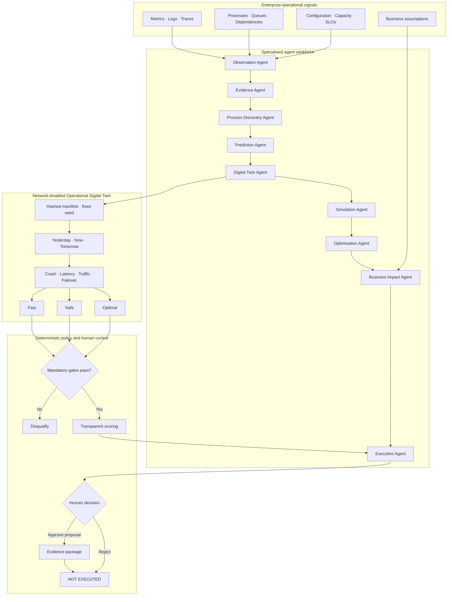

<h1 align="center">🛡️ SentinelOps Nexus</h1>
<h3 align="center">The Enterprise Operational Digital Twin</h3>

<p align="center"><strong>Predict tomorrow's operational bottleneck before customers experience it.</strong></p>

<p align="center">
  <a href="#quick-start">Quick Start</a> ·
  <a href="#architecture">Architecture</a> ·
  <a href="docs/demo-script.md">Judge Demo</a> ·
  <a href="docs/safety.md">Safety</a>
</p>

## Why SentinelOps Nexus

Most reliability tools explain an outage after customers are affected. SentinelOps Nexus builds a deterministic operational Digital Twin from telemetry, service dependencies, configuration, and business assumptions. A specialised AI workforce forecasts bottlenecks, simulates future and chaos conditions, compares interventions, and presents an evidence-backed recommendation for human approval.

It does **not** automatically execute production changes.

## Finale experience

1. Begin with a healthy Payment Service.
2. Watch traffic and Redis saturation trend upward.
3. Predict the safe-capacity threshold crossing before the existing alert fires.
4. Move the Time Travel control from history to `+30 minutes`.
5. Inspect the evidence and agent-to-agent reasoning trace.
6. Change traffic and Redis capacity in the Digital Twin.
7. Run Redis crash, latency, failover, and million-user scenarios.
8. Compare Fast, Safe, and Optimal interventions.
9. See the plausible Fast strategy disqualified by the failover gate.
10. Review estimated customer and revenue exposure with visible assumptions.
11. Stop at the human decision boundary with `PRODUCTION ACTION: NOT EXECUTED`.

## Measurable demonstration

All displayed forecast values are calculated from the seeded telemetry window and explicit configuration. Confidence is a labelled heuristic evidence score, not a calibrated probability. Revenue exposure is an estimate based on the displayed conversion rate, order value, request forecast, and risk window.

## Architecture



## Core capabilities

- Predictive bottleneck detection and time-to-impact forecast
- Interactive Yesterday–Now–Tomorrow Time Travel
- Network-disabled deterministic Digital Twin
- Chaos and nearby-condition simulation
- Fast/Safe/Optimal intervention tournament
- Mandatory-gate disqualification independent of model confidence
- Evidence-linked business-impact estimation
- Executive Copilot decision brief
- Human approval and no automatic production execution
- Existing reactive investigation path retained as a secondary capability

## Quick Start

```powershell
python -m venv .venv
.\.venv\Scripts\python.exe -m pip install -e ".[dev]"
Set-Location frontend
pnpm install
Set-Location ..
.\.venv\Scripts\python.exe -m uvicorn backend.app.main:app --reload --port 8000
```

In another terminal:

```powershell
Set-Location frontend
pnpm dev
```

Open `http://localhost:5173`.

## Validation

```powershell
.\.venv\Scripts\python.exe -m pytest backend\tests demo_app\tests -q
.\.venv\Scripts\python.exe -m ruff check backend demo_app scripts
.\.venv\Scripts\python.exe -m mypy backend demo_app scripts
.\.venv\Scripts\python.exe -m bandit -q -lll -r backend demo_app scripts
Set-Location frontend
pnpm test
pnpm run build
```

## Safety and honesty

- Predictions are estimates under documented assumptions.
- Confidence labels are not guaranteed probabilities.
- Business impact is not an accounting result.
- No formal verification or guaranteed causality is claimed.
- The model cannot approve its own recommendation.
- No production deployment or intervention path is configured.

## Independent deployment

`render.yaml` defines three services exclusively for this repository:

- `janicebenita-sentinelops-nexus`
- `janicebenita-sentinelops-nexus-api`
- `janicebenita-sentinelops-nexus-simulator`

The original finalist SentinelOps repository and Render services are not modified.
