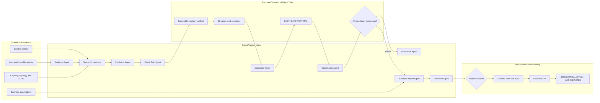

<h1 align="center">SentinelOps Nexus</h1>
<h3 align="center">The Enterprise Operational Digital Twin</h3>

<p align="center"><strong>Predict tomorrow's operational bottleneck before customers experience it.</strong></p>

<p align="center">
  
  
  
  
  
</p>

<p align="center">
  <a href="https://janicebenita-sentinelops-nexus.onrender.com"><strong>Open live demo</strong></a> |
  <a href="#quick-start">Quick Start</a> | <a href="#architecture">Architecture</a> |
  <a href="#guided-product-demo">Guided Demo</a> | <a href="docs/safety.md">Safety</a> |
  <a href="#evaluation-evidence">Evaluation Evidence</a>
</p>

> **National AI Agent Builder Finale submission for the B2B Services challenge: Late Bottleneck Detection.**<br>
> **Working-build status:** deterministic local workflow validated without paid credentials<br>
> **Safety boundary:** **PRODUCTION ACTION: NOT EXECUTED**

## The problem

Traditional operational tooling often alerts after a customer-facing threshold has already been crossed. SentinelOps Nexus asks a more useful question: **which constraint is likely to become the next bottleneck, when will it affect customers, and which intervention is safest under nearby failure conditions?**

## Evaluation Evidence

The seeded Payment Service begins healthy while traffic and Redis pressure rise. Nexus forecasts the Redis safe-capacity crossing before the reactive error alert, creates a hashed bounded Digital Twin, runs 12 deterministic scenarios, evaluates three interventions, rejects a plausible false fix, estimates business exposure using visible equations, and stops at a human decision.

### Key Evaluation Questions

| Question | Evidence-Backed Answer |
|---|---|
| What bottleneck is emerging? | Redis saturation on the Payment Service critical path |
| When is safe capacity crossed? | At +30 minutes in the canonical deterministic seed |
| When may customers be affected? | At +45 minutes under the documented assumptions |
| How many scenarios are replayed? | 12 scenarios using the same Twin manifest and random seed |
| Which false fix is detected? | FAST fails the mandatory failover safety gate |
| Which strategy is recommended? | The highest-scoring eligible candidate; currently OPTIMAL |
| Is confidence a probability? | No. It is a heuristic evidence score |
| Is revenue exposure guaranteed? | No. It is an operational estimate based on visible inputs |
| Does approval deploy anything? | No. Approval records a human decision and enables evidence export |

### Intervention Decision Matrix

| Intervention | Intent | Mandatory gates | Eligible | Decision |
|---|---|---:|---:|---|
| **FAST** | Scale application replicas immediately | Failover safety fails | No | Disqualified regardless of score |
| **SAFE** | Redis capacity + controlled failover + traffic shaping | Pass | Yes | Lower-cost eligible alternative |
| **OPTIMAL** | Redis capacity + cache-policy correction + gradual scaling | Pass | Yes | Recommended by transparent score |

Eligibility overrides score. A failed mandatory gate can never be outweighed by model confidence.

## Guided Product Demo

The canonical demonstration shows how SentinelOps Nexus predicts a Redis bottleneck before a reactive alert, builds a bounded Digital Twin, replays 12 deterministic scenarios, rejects a plausible but unsafe intervention, estimates business exposure, and stops at a human decision boundary.

The command centre now supports two complementary paths from the mode switcher at the top of the live UI:

- **One-click Guided Demo** starts a six-stop auto-playing tour of the early signal, transparent forecast, bounded Twin, deterministic scenarios, false-fix rejection, and human decision boundary. The tour can be paused, moved forwards or backwards, or exited at any point. It never presses the approval button.
- **Explore Mode** exposes four bounded controls, four presets, and a manual operational-JSON upload. Change or import traffic, Redis capacity, application replicas, and dependency latency; persist a new workflow; replay all twelve backend-calculated scenarios; then select any scenario to inspect its inputs, recovery, outcome, and deterministic hash. Uploaded evidence is content-hashed and recorded in the backend audit chain.

Use [`docs/sample-explore-controls.json`](docs/sample-explore-controls.json) to exercise the upload workflow.

Both modes use the real versioned API. Rerun means simulation only, approval means decision recording only, and **PRODUCTION ACTION: NOT EXECUTED** remains visible throughout.

## Narrated walkthrough

The reproducible video generator renders a synchronized nine-scene Nexus simulation as a 1080p H.264/AAC walkthrough with SRT captions and professional female Indian-English narration. Every visual is purpose-built for its narration scene; the final approval control is never activated.

```powershell
& ".\.venv\Scripts\python.exe" scripts\generate_storytelling_video.py --install
```

Generated artifacts:

- [Narrated demo video](demo_storytelling_video.mp4) — committed submission-ready MP4, validated at 4:50
- [Captions](demo_storytelling_video.srt) — committed synchronized subtitles
- `voice.wav`
- `storytelling-output/` intermediate recordings and narration segments

The lossless voice track and intermediate browser recordings remain gitignored build outputs.

The default voice is Microsoft `en-IN-NeerjaNeural` at a measured pace. Narration is normalized globally to a consistent broadcast-style level. Narration text is sent to Microsoft Edge TTS when the generator runs, so use it only where that external processing is acceptable.

## Architecture



The Digital Twin is a **bounded operational model under documented assumptions**, not a perfect production replica.

## Yesterday - Now - Tomorrow

The command centre exposes five canonical points: Yesterday, Now, +15, +30 and +45 minutes. Operators can change traffic, Redis capacity, application replicas and dependency latency, then create and run a new persisted workflow. Forecast calculations remain deterministic and visible:

```text
memory_pct(t) = current_memory_pct + saturation_slope * minutes
threshold crossing = (safe_threshold - current_memory_pct) / saturation_slope
```

The UI shows the forecast method, threshold, residual MAE, error bound, assumptions and linked evidence IDs.

## Twelve deterministic scenarios

Baseline growth, Redis crash, Redis latency, replica failover, 10x traffic, one-million-user stress, reduced Redis capacity, increased application replicas, rollback, rate limiting, cache-policy correction and configuration drift.

Every result includes inputs, status, p95 latency, error rate, recovery estimate, evidence references and a deterministic SHA-256 hash.

## Human control and audit export

Only backend policy changes workflow state. The model/provider cannot approve a recommendation. Human approval means:

1. Record the named human decision and rationale.
2. Append it to the chained audit timeline.
3. Permit export of the evidence package.

It never means deployment or production execution. The ZIP contains incident, Twin manifest, evidence, forecast, scenarios, tournament, verification, business impact, executive brief, audit events and `manifest.sha256`.

## Key Technical Questions

- How are forecasts produced? A transparent bounded linear saturation model exposes its equation, threshold, residual error and assumptions.
- How are scenarios compared? All 12 scenarios use the same immutable Twin manifest and random seed.
- How are unsafe recommendations blocked? Mandatory eligibility gates override candidate scores.
- What does approval do? It records a human decision and enables evidence export; it never performs a production action.

## Implementation Status

| Layer | Status |
|---|---|
| Deterministic local provider and seeded workflow | **Implemented and tested** |
| FastAPI `/api/v1`, SQLite persistence and SSE audit events | **Implemented and tested** |
| React command centre backed by persisted API data | **Implemented and tested** |
| Digital Twin, scenarios, tournament, impact and export | **Implemented and tested** |
| Optional Gemini/OpenAI narrative adapters | Adapter boundary exists; not required for the demo |
| Google ADK, A2A and MCP enterprise connectors | Continued research / production evolution |
| Vertex AI, Pub/Sub, Spanner Graph, BigQuery ML and Looker | Continued research; not active in this build |

## Technology stack

- FastAPI, Pydantic v2, SQLAlchemy and SQLite
- React 18, TypeScript, Vite, TanStack Query and Recharts
- Pytest, Ruff, MyPy, Bandit and Vitest
- Docker Compose and Render Blueprint configuration
- Deterministic mock provider by default; no paid key required

## Quick Start

### Run on Windows with one command

Double-click `start-sentinelops.cmd`, or run:

```powershell
.\start-sentinelops.cmd
```

The launcher prepares missing dependencies, starts the frontend, API and simulator, verifies their health, and opens `http://localhost:5173`. Keep its terminal window open while using the software; press `Ctrl+C` to stop it.

### Windows PowerShell

```powershell
python -m venv .venv
& ".\.venv\Scripts\python.exe" -m pip install -e ".[dev]"
Set-Location frontend
pnpm install
Set-Location ..
& ".\.venv\Scripts\python.exe" -m uvicorn backend.app.main:app --reload --port 8000
```

In a second terminal:

```powershell
Set-Location frontend
pnpm dev
```

### Linux or macOS

```bash
python3 -m venv .venv
./.venv/bin/python -m pip install -e '.[dev]'
cd frontend && pnpm install && cd ..
./.venv/bin/python -m uvicorn backend.app.main:app --reload --port 8000
```

Open `http://localhost:5173`. API documentation is at `http://localhost:8000/docs`.

## Validation and Reproducibility

```powershell
& ".\.venv\Scripts\python.exe" -m pytest backend\tests demo_app\tests -q
& ".\.venv\Scripts\python.exe" -m ruff check backend demo_app scripts
& ".\.venv\Scripts\python.exe" -m mypy backend demo_app scripts
& ".\.venv\Scripts\python.exe" -m bandit -q -lll -r backend demo_app scripts
& ".\.venv\Scripts\python.exe" scripts\nexus_e2e.py
Set-Location frontend
pnpm test
pnpm run build
```

## Render deployment

| Live resource | URL |
|---|---|
| Command centre | [Open SentinelOps Nexus](https://janicebenita-sentinelops-nexus.onrender.com) |
| Versioned API | [API health](https://janicebenita-sentinelops-nexus-api.onrender.com/api/v1/health) |
| Simulator | [Simulator health](https://janicebenita-sentinelops-nexus-simulator.onrender.com/health) |
| Render Blueprint | [Deployment dashboard]((https://janicebenita-sentinelops-nexus.onrender.com/)) |

`render.yaml` defines independent Nexus services and does not modify the earlier SentinelOps deployment:

- `janicebenita-sentinelops-nexus`
- `janicebenita-sentinelops-nexus-api`
- `janicebenita-sentinelops-nexus-simulator`

Render free services may cold-start. SQLite storage is ephemeral there; reset and replay are intentionally deterministic. PostgreSQL is recommended for durable production operation.

## Honest limitations

- The included telemetry is deterministic seeded demonstration data, not a live enterprise feed.
- The forecast is a transparent bounded linear model, not calibrated predictive probability.
- Simulation covers documented variables and is not a complete replica of production.
- Business-impact results are estimates, not accounting results or guaranteed savings.
- Enterprise connectors and Google-scale services shown in the research architecture are not active integrations in this working build.
- The frontend bundle currently produces a non-blocking Vite chunk-size warning.

## Documentation

- [Product Requirements Document](docs/product-requirements.md)
- [Architecture](docs/architecture.md)
- [API](docs/api.md)
- [Guided Product Demo](docs/demo-script.md)
- [Evaluation](docs/evaluation.md)
- [Safety](docs/safety.md)
- [Limitations](docs/limitations.md)
- [Evaluation Q&A](docs/judge-qa.md)
- [Implementation plan](docs/implementation-plan.md)

## Author

Built by [Janice Benita F](https://github.com/Janicebenita) for the National AI Agent Builder Finale.

Contributions are welcome through focused issues and pull requests. Changes must preserve deterministic gates, evidence traceability, the human approval boundary and the absence of automatic production execution.
