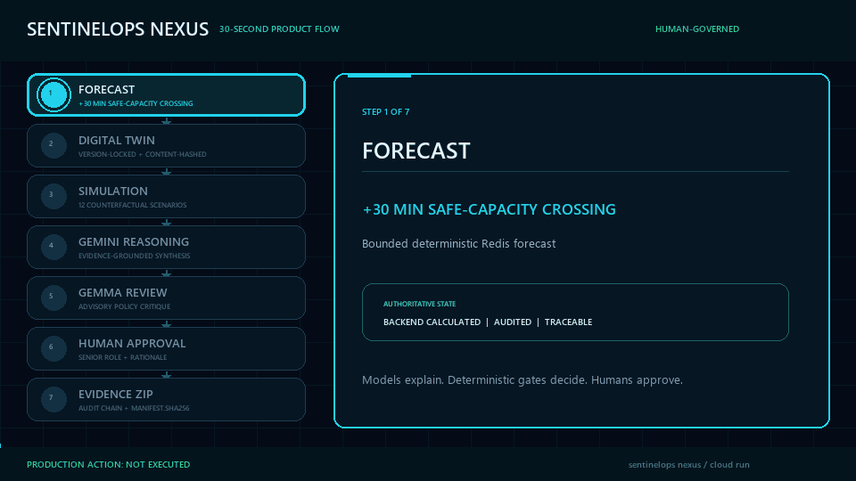

<p align="center">
  
</p>

<h1 align="center">🛡️ SentinelOps Nexus</h1>

<p align="center"><strong>The Enterprise Operational Digital Twin</strong></p>
<p align="center"><em>Predict tomorrow's operational bottleneck before customers experience it.</em></p>

<p align="center">
  <a href="https://sentinelops-frontend-398391487181.asia-south1.run.app/"></a>
  <a href="https://github.com/Janicebenita/SentinelOps-X/actions/workflows/validate.yml"></a>
  
  
</p>

<p align="center">
  <a href="https://sentinelops-frontend-398391487181.asia-south1.run.app/"><strong>🚀 Open Live Product</strong></a>
  ·
  <a href="https://sentinelops-frontend-398391487181.asia-south1.run.app/command-centre"><strong>🧭 Command Centre</strong></a>
  ·
  <a href="https://sentinelops-frontend-398391487181.asia-south1.run.app/judge-demo"><strong>🎬 Guided Demo</strong></a>
  ·
  <a href="docs/architecture.md"><strong>🏗️ Architecture</strong></a>
</p>

<p align="center">
  <a href="https://sentinelops-frontend-398391487181.asia-south1.run.app/judge-demo">
    
  </a>
</p>

<p align="center"><strong>Forecast → Digital Twin → Simulation → Gemini Reasoning → Gemma Review → Human Approval → Evidence ZIP</strong></p>
<p align="center"><sub>30-second product flow · click the animation to open the interactive backend-driven demo</sub></p>

> National AI Agent Builder Finale submission for the B2B Services challenge: Late Bottleneck Detection.

> [!IMPORTANT]
> **PRODUCTION ACTION: NOT EXECUTED**
>
> Approval records a governed human decision and enables evidence export.
>
> It does not deploy, scale, roll back, reconfigure, or modify production infrastructure.

## 🌐 Live deployment status

| Environment | Status | Purpose |
|---|---|---|
| Local | IMPLEMENTED_AND_VERIFIED | Complete deterministic workflow and reproducible validation |
| Google Cloud Run | IMPLEMENTED_AND_VERIFIED | Primary live deployment; nine services passed health and readiness smoke checks |

## 🚀 Live product

- **Primary application:** [Open SentinelOps Nexus on Google Cloud Run](https://sentinelops-frontend-398391487181.asia-south1.run.app/)
- **Command Centre:** [Open the operational workspace](https://sentinelops-frontend-398391487181.asia-south1.run.app/command-centre)
- **Guided product demo:** [Start the deterministic judge workflow](https://sentinelops-frontend-398391487181.asia-south1.run.app/judge-demo)
- Local application: `http://localhost:5173/`
- Local Command Centre: `http://localhost:5173/command-centre`
- Local five-minute evidence workspace: `http://localhost:5173/judge-demo`

Google Cloud Run is the primary live judge-demo environment. The deployed frontend and API passed direct HTTP, runtime-configuration, readiness, and browser CORS checks; all nine Cloud Run service health and readiness endpoints passed the authenticated deployment smoke test.

SentinelOps Nexus is an evidence-driven operational decision-support product. It forecasts emerging Redis saturation, builds a bounded Digital Twin, replays 12 deterministic scenarios, compares FAST, SAFE, and OPTIMAL interventions, applies mandatory safety gates, and stops at an authorized human decision boundary.

[Quick Start](#running-locally) | [Architecture](#architecture-summary) | [Guided Demo](#guided-product-demo) | [Safety](#security-and-human-control) | [Evaluation Evidence](#evaluation-evidence)

## 🎯 Project overview

The canonical seeded workflow models a Payment Service whose Redis memory pressure rises before a reactive alert fires. Under the documented deterministic seed, SentinelOps Nexus:

- forecasts the Redis safe-capacity crossing at **+30 minutes**;
- estimates possible customer impact at **+45 minutes**;
- creates a version-locked, content-hashed Digital Twin;
- replays **12 deterministic scenarios**;
- disqualifies FAST when its mandatory failover gate fails;
- recommends the highest-scoring eligible candidate, currently OPTIMAL;
- generates an evidence-grounded executive brief;
- requires a qualified human decision and rationale; and
- exports a verifiable Evidence ZIP with `manifest.sha256`.

The bounded deterministic forecast and mandatory safety gates remain authoritative. Model output cannot approve, change workflow state, override eligibility, or execute a production action.

## 🏗️ Architecture summary

```text
Telemetry Ingestion
        ↓
Redis Forecast Service
        ↓
Digital Twin Engine
        ↓
Simulation Engine
        ↓
Optimization Engine
        ↓
Gemini Enterprise Agent Platform (formerly Vertex AI)
        ↓
Gemma Private Policy Review Engine
        ↓
Mandatory Safety Gates
        ↓
Verification Agent
        ↓
Executive Recommendation Generator
        ↓
AWAITING_HUMAN
        ↓
Human Approval Stage
        ↓
Tamper-Evident SHA-256-Linked Audit Chain
        ↓
Evidence ZIP Export
```

This ordering is a safety invariant. Executive recommendation follows mandatory gates and verification. Human approval follows verification and the explicit `AWAITING_HUMAN` state.

The complete architecture is documented in [docs/architecture.md](docs/architecture.md) and the [single-page architecture board](docs/assets/sentinelops-nexus-architecture.pdf).

## 🧠 Google AI lifecycle and authority

SentinelOps Nexus follows the Google-native AI engineering lifecycle in this order:

```text
Google AI Studio
        ↓
Prompt Management
        ↓
Prompt Evaluation
        ↓
Gemini Enterprise Agent Platform Runtime (formerly Vertex AI)
        ↓
Gemma Private Policy Review Engine
```

### 1. Google AI Studio

Google AI Studio is the prompt-development and evaluation workspace—not the production runtime. It supports iterative design of evidence-grounded tasks before approved prompt assets enter version control. The repository does not claim a verified Studio session without authenticated session evidence.

### 2. Prompt management

Version-controlled assets under `prompts/gemini/`, `prompts/gemma/`, `prompts/schemas/`, and `prompts/evaluations/` define prompt IDs, versions, CRISPE context, evidence inputs, allowed tools, prohibited actions, refusal conditions, strict output schemas, and bounded fallbacks.

### 3. Prompt evaluation

Automated schema and evaluation tests check expected evidence references, structured outputs, safety refusals, deterministic-authority boundaries, and prohibited approval or production behavior before a prompt can support the canonical workflow.

### 4. Gemini Enterprise Agent Platform runtime (formerly Vertex AI)

Gemini Enterprise Agent Platform (formerly Vertex AI) is the primary AI reasoning runtime in the Google-native architecture. When Google credentials are configured, it provides:

- evidence-grounded reasoning;
- contradiction and missing-evidence detection;
- scenario and candidate explanations;
- recommendation synthesis;
- business-impact explanation; and
- executive summaries.

Gemini output is schema-validated, evidence-referenced, hashed, traced, audited, and bounded by deterministic fallback behavior. Gemini never approves, executes production actions, bypasses safety gates, or directly mutates workflow state.

### 5. Gemma Private Policy Review Engine

The Gemma Private Policy Review Engine provides a secondary policy and safety review for:

- recommendation-to-gate consistency;
- evidence completeness;
- policy-violation classification;
- contradiction review; and
- unsafe-recommendation critique.

The Gemma Private Policy Review Engine is advisory. It cannot override Mandatory Safety Gates, approve, change workflow state, or execute production actions.

### Backend authority

The FastAPI backend remains authoritative for:

- deterministic forecasts and scenario calculations;
- intervention eligibility and safety gates;
- workflow-state transitions;
- role verification and approval authorization;
- recording the qualified human decision and rationale;
- the tamper-evident SHA-256-linked audit chain; and
- Evidence ZIP generation.

No model approves a recommendation. Only an authorized human can submit a decision that the backend validates and records.

## 🤝 Agent orchestration

The current AI Workforce uses an ADK-compatible orchestration boundary and agent registry. The official Google ADK runtime has not yet been verified in the authenticated environment, so its current status is `LOCAL_ADAPTER_ONLY`. The boundary coordinates structured agent execution and Agent-to-Agent (A2A) handoffs while the backend retains workflow authority.

The workforce includes:

- Nexus Orchestrator;
- Observer Agent;
- Evidence Agent;
- Process Discovery Agent;
- Prediction Agent;
- Digital Twin Agent;
- Simulation Agent;
- Optimization Agent;
- Verification Agent;
- Business Impact Agent; and
- Executive Agent.

Every visible agent card is clickable and opens a backend-driven workspace. Supported run and rerun actions persist status, duration, retry count, inputs, outputs, evidence references, result hashes, and audit events. Typed A2A messages carry workflow, task, correlation, causation, artifact, evidence, status, and trace metadata without storing hidden chain-of-thought.

The official Google ADK runtime was not available in the validated local environment. Local adapter tests are not presented as official managed-runtime evidence.

## 🧰 Controlled MCP tools

MCP is the authenticated, controlled tool interface used by agents. Implemented read-only and bounded tools cover:

- telemetry and latest-metric retrieval;
- service topology and SLO retrieval;
- incident and evidence retrieval;
- Digital Twin manifest creation;
- scenario execution and result access;
- tournament and gate-result access;
- simulation access;
- business-impact calculation; and
- Evidence ZIP export.

MCP tools use strict schemas, authorization, rate limits, correlation IDs, trace IDs, audit events, safe errors, and idempotency where applicable. No MCP tool can deploy, scale, roll back, reconfigure, execute shell commands, or modify cloud infrastructure.

## 🛰️ Antigravity integration boundary

SentinelOps Nexus includes a typed, read-only Antigravity participant boundary without inventing an unsupported SDK or runtime contract.

| Capability | Current evidence |
|---|---|
| Backend status API | `GET /api/v1/integrations/antigravity/status` |
| Product visibility | Antigravity status is surfaced in the guided evidence workspace |
| Safety | Read-only provider; no workflow mutation, approval, gate override, infrastructure action, or production execution |
| Validation | Provider contract and truthful-status tests run in CI |
| Official runtime | `BLOCKED_BY_PARTICIPANT_ACCESS` because official participant documentation, SDK, endpoint, and credentials are unavailable |

The implemented boundary is `LOCAL_ADAPTER_ONLY`. It returns explicit blocker and fallback metadata and always preserves **PRODUCTION ACTION: NOT EXECUTED**. A local adapter response is never represented as an official Antigravity invocation. See [Antigravity Integration](docs/antigravity-integration.md).

## 🗄️ Data and event architecture

### Transactional workflow state

The backend transactional store is authoritative for workflows, agent executions, verification records, human decisions, and audit-chain state. SQLite provides deterministic local and demonstration persistence. BigQuery is not used as the transactional workflow authority.

### BigQuery analytics

In configured Google Cloud mode, BigQuery is the analytical and historical warehouse for:

- historical telemetry;
- forecast analytics;
- simulation results;
- verification results;
- model-invocation metadata;
- audit exports; and
- evidence metadata.

The repository includes nine partitioned and clustered schemas plus credential-gated provisioning and write/read smoke tooling. Its status is `IMPLEMENTED_REQUIRES_CREDENTIALS`; no live BigQuery use is claimed without an authenticated write/read result and row ID.

### Pub/Sub eventing

Pub/Sub is the asynchronous event-backbone target for:

- Telemetry Events;
- Agent Task Events;
- Simulation Events;
- Verification Events;
- Model Invocation Events;
- Evidence Export Events;
- Workflow Status Events; and
- BigQuery Export Events.

Typed event envelopes include idempotency, retry, dead-letter, causation, correlation, and trace metadata. Provisioning and publish/consume smoke tooling exist, so the managed integration is `IMPLEMENTED_REQUIRES_CREDENTIALS`. The validated local build uses an idempotent local adapter, and managed publish/consume success is not claimed without an authenticated message ID.

## ✨ Key features

- Transparent bounded Redis saturation forecast
- Version-locked and content-hashed Digital Twin manifest
- Fixed deterministic seed and 12 reproducible scenarios
- FAST, SAFE, and OPTIMAL intervention tournament
- Mandatory eligibility gates that override score
- Verification Agent with persisted technical and approver checks
- Google AI Studio prompt lifecycle with versioned CRISPE assets and automated evaluations
- Evidence-grounded Gemini reasoning with deterministic fallback
- Gemma Private Policy Review Engine safety-critique boundary
- Clickable, backend-connected AI Workforce
- Typed, persisted, and traced A2A messages
- Authenticated MCP tool gateway
- Role-qualified human decisions with mandatory rationale
- Tamper-evident SHA-256-linked audit chain
- Verifiable Evidence ZIP containing `manifest.sha256`
- Explicit absence of any production execution endpoint

## 🔎 Evaluation evidence

| Key evaluation question | Evidence-backed answer |
|---|---|
| What bottleneck is emerging? | Redis saturation on the Payment Service critical path |
| When is safe capacity crossed? | +30 minutes in the canonical deterministic seed |
| When may customers be affected? | +45 minutes under the displayed assumptions |
| How many scenarios are replayed? | 12 using the same Twin manifest and fixed seed |
| Which false fix is detected? | FAST fails the mandatory failover gate |
| Which strategy is recommended? | The highest-scoring eligible candidate; currently OPTIMAL |
| Is confidence a probability? | No. It is a heuristic evidence score |
| Is revenue exposure guaranteed? | No. It is an operational estimate based on visible inputs |
| Does approval deploy anything? | No. It records a governed human decision and enables evidence export |

## 🎬 Guided product demo

The Judge Demo provides a 20-stage, five-minute interactive workflow with keyboard-accessible cards, direct links, and an inline purpose-first evidence panel that expands immediately beside the selected block. Every card exposes `aria-expanded`, supports arrow-key navigation, and shows its large explanation without requiring the judge to find a separate panel elsewhere on the page. Play, pause, previous, next, restart, Exit Guided Mode, restrained motion, and explicit fallback or credential states remain available. Every stage first explains its operational purpose, implemented value, and remaining live-operation gap before presenting its backend-supported evidence status. It never submits approval. Its Google Cloud evidence stage explains why each managed integration is retained; missing Cloud Build, Artifact Registry, BigQuery, Pub/Sub, or Trace identifiers are never presented as verified. The command centre also supports manual Explore Mode: operators can change traffic, Redis capacity, application replicas, and dependency latency; load presets; upload operational JSON; replay all 12 backend-calculated scenarios; and inspect the resulting evidence and hashes.

The guided experience never activates approval. The narrated video remains a separate supporting artifact: [demo_storytelling_video.mp4](demo_storytelling_video.mp4).

Frontend routes include:

| Product area | Route |
|---|---|
| Landing page | `/` |
| Five-minute Judge Demo | `/judge-demo` |
| Command Centre | `/command-centre` |
| AI Workforce | `/agents` |
| Agent Workspace | `/agents/:agentName` |
| Workflow detail | `/workflows/:workflowId` |
| Verification | `/workflows/:workflowId/verification` |
| Human decision | `/workflows/:workflowId/approval` |
| Evidence, audit, and export | `/workflows/:workflowId/evidence`, `/audit`, `/export` |
| Architecture, safety, and docs | `/architecture`, `/safety`, `/docs` |
| Google-stack evidence | `/google-stack`, `/integrations`, `/observability`, `/security-status`, `/model-evaluation` |

## 🗂️ Repository structure

```text
backend/                 FastAPI API, workflows, agents, security, audit, providers
frontend/                React and TypeScript application
services/                Independently packageable service entry points
prompts/                 Versioned Gemini/Gemma prompts and evaluations
deploy/cloud-run/        Cloud Run service manifests and frontend routing
scripts/                 Validation, provisioning, deployment, and smoke tooling
sql/                     BigQuery analytical schemas
docs/                    PRD, architecture, safety, evaluation, and deployment evidence
.github/workflows/       Local validation and controlled Google Cloud workflows
Dockerfile.*             Service-specific container definitions
cloudbuild.yaml          Commit-SHA image build configuration
```

## ⚙️ Technology stack

| Layer | Technology |
|---|---|
| Frontend | React 18, TypeScript, Vite, TanStack Query, Recharts |
| Backend | Python 3.11+, FastAPI, Pydantic v2, SQLAlchemy |
| Deterministic engine | Python forecasting, Digital Twin, simulation, optimization, safety gates |
| Prompt lifecycle | Google AI Studio workflow, versioned CRISPE prompts, schemas, evaluation cases |
| AI reasoning | Gemini Enterprise Agent Platform (formerly Vertex AI), Gemma Private Policy Review Engine, deterministic fallback |
| Agent protocols | Google ADK boundary, typed A2A, authenticated MCP |
| Transactional persistence | SQLite for the deterministic working build |
| Analytical persistence | BigQuery analytical schemas and credential-gated provision/write/read tooling |
| Async eventing | Pub/Sub provisioning/smoke tooling with local idempotent fallback adapter |
| Observability | OpenTelemetry-compatible trace metadata, Cloud Logging, Cloud Monitoring, Cloud Trace targets |
| Cloud delivery | GitHub Actions, Cloud Build, Artifact Registry, Cloud Run, Secret Manager, IAM, ADC |
| Quality | Pytest, Vitest, Ruff, MyPy, Bandit, dependency and secret scanning |

## 🔐 Security and human control

Security controls include:

- OAuth2/OIDC-ready configuration;
- signed, short-lived JWT role tokens;
- backend-authoritative RBAC;
- backend authorization for every human decision;
- least-privilege Cloud Run IAM design;
- Secret Manager references for deployed secrets;
- rate limiting and request-size limits;
- replay protection and idempotency controls;
- strict Pydantic validation, CORS, and security headers;
- mandatory rationale for Senior Developer approval; and
- explicit model and tool non-authority.

Trial credentials are for demonstration only:

| Role | Trial code | Approval behavior |
|---|---:|---|
| Intern | `0000` | May inspect and simulate; cannot approve |
| Senior Developer | `1111` | May approve only after role verification and with mandatory rationale |

Production deployments must replace trial credentials with enterprise identity, SSO, and managed RBAC. Codes remain server-side and must never be bundled into frontend assets, persisted in plaintext, logged, returned, or exported.

## 📡 Observability

The architecture propagates request IDs, correlation IDs, trace IDs, and AI invocation IDs through HTTP, agent, A2A, MCP, model, simulation, verification, authorization, decision, and evidence flows. Services emit structured logs with those identifiers where configured.

OpenTelemetry is the instrumentation boundary. Where Google Cloud credentials and exporters are configured, telemetry targets Cloud Logging, Cloud Monitoring, and Cloud Trace. The local build verifies trace propagation and invocation metadata; it does not claim exported Google Cloud traces without a live trace ID.

Secrets, trial codes, API keys, hidden chain-of-thought, unredacted prompts, and sensitive evidence payloads must not be logged.

## ☁️ Deployment

Google Cloud Run is the primary deployment target. The release pipeline and connected runtime services are:

```text
GitHub
  ↓
GitHub Actions
  ↓
Cloud Build
  ↓
Artifact Registry
  ↓
Cloud Run
  ├── Secret Manager
  ├── BigQuery
  ├── Pub/Sub
  ├── Cloud Logging
  ├── Cloud Monitoring
  ├── Cloud Trace
  ├── IAM / Service Accounts
  └── Application Default Credentials
```

Cloud Build builds commit-SHA-tagged service images. Artifact Registry stores those images. Cloud Run deploys revisions from those stored images. The existence of `cloudbuild.yaml`, Dockerfiles, or deployment manifests is configuration evidence—not proof that an image was pushed or a Cloud Run revision was deployed.

The runtime architecture uses Application Default Credentials (ADC), Cloud Run service accounts, least-privilege IAM, Secret Manager references, and GitHub OIDC with Workload Identity Federation. No service-account JSON key or frontend API key is required.

Nine independently packaged Cloud Run services are defined and deployed:

- `sentinelops-frontend`
- `sentinelops-api-gateway`
- `sentinelops-orchestrator`
- `sentinelops-forecast-service`
- `sentinelops-simulation-service`
- `sentinelops-verification-service`
- `sentinelops-evidence-service`
- `sentinelops-gemma-service`
- `sentinelops-mcp-server`

Cloud Run deployment is `IMPLEMENTED_AND_VERIFIED`: live service URLs and revisions exist, deployment IAM updates completed, every service passed health and readiness smoke checks, and the public frontend-to-API runtime configuration and CORS path were verified.

## 💻 Running locally

### Prerequisites

- Python 3.11+
- Node.js 20+
- pnpm

### Backend

```powershell
python -m venv .venv
& ".\.venv\Scripts\python.exe" -m pip install -e ".[dev]"
& ".\.venv\Scripts\python.exe" -m uvicorn backend.app.main:app --reload --port 8000
```

### Frontend

```powershell
Set-Location frontend
pnpm install
pnpm dev
```

Open:

- Landing page: `http://localhost:5173/`
- Command Centre: `http://localhost:5173/command-centre`
- API documentation: `http://localhost:8000/docs`

The complete deterministic local workflow runs without paid AI credentials. Missing managed providers activate visible, bounded fallback behavior rather than fabricated cloud success.

## ☁️ Running on Google Cloud

Prerequisites are an authenticated Google Cloud CLI, billing access to `sentinelops-nexus-finale`, and the approved `asia-south1` region.

```bash
export PROJECT_ID=sentinelops-nexus-finale
export REGION=asia-south1

bash scripts/provision_google_cloud.sh
gcloud builds submit --config cloudbuild.yaml \
  --substitutions=_REGION=asia-south1,COMMIT_SHA=$(git rev-parse HEAD) .
REVISION=$(git rev-parse HEAD) bash scripts/deploy_cloud_run.sh

python scripts/smoke_cloud_run.py
python scripts/smoke_bigquery.py
python scripts/smoke_pubsub.py
bash scripts/verify_google_cloud.sh
```

Provisioning creates secret containers but never creates or prints secret values. Add approved Secret Manager versions before deployment. Do not claim deployment success unless all authenticated smoke checks pass and their non-secret evidence IDs are recorded.

## 🧪 Testing

### Backend, security, and end-to-end

```powershell
& ".\.venv\Scripts\python.exe" -m pytest backend\tests demo_app\tests -q
& ".\.venv\Scripts\python.exe" -m ruff check backend demo_app scripts
& ".\.venv\Scripts\python.exe" -m mypy backend demo_app scripts
& ".\.venv\Scripts\python.exe" -m bandit -q -lll -r backend demo_app scripts
& ".\.venv\Scripts\python.exe" scripts\nexus_e2e.py
```

### Frontend

```bash
cd frontend
pnpm test
pnpm run build
```

Tests cover deterministic forecasts, scenarios, mandatory gates, agent execution, A2A and MCP contracts, Gemini Enterprise Agent Platform (formerly Vertex AI) and Gemma Private Policy Review Engine authority boundaries, role verification, Intern rejection, Senior rationale requirements, audit-chain validation, Evidence ZIP verification, frontend routes, and absence of production-execution endpoints.

## 🔄 CI/CD

`.github/workflows/validate.yml` runs backend and frontend tests, type checks, Ruff, MyPy, Bandit, dependency scanning, secret scanning, provider/prompt/protocol/security tests, Docker builds, the end-to-end workflow, and proof that no production-execution route exists.

`.github/workflows/google-cloud-runtime.yml` is a protected `workflow_dispatch` workflow using GitHub OIDC and Workload Identity Federation. Paid or state-changing cloud checks are not run automatically on every pull request.

## ✅ Implementation status

| Component | Status | Evidence boundary |
|---|---|---|
| Deterministic workflow, Digital Twin, 12 scenarios, tournament, and mandatory gates | IMPLEMENTED_AND_VERIFIED | Local tests and reproducible end-to-end workflow |
| Human approval, Intern block, Senior rationale, audit chain, and Evidence ZIP | IMPLEMENTED_AND_VERIFIED | Backend authorization and export validation tests |
| Google AI Studio prompt lifecycle | IMPLEMENTED_REQUIRES_CREDENTIALS | Thirteen task-level CRISPE prompts, schema, and evaluation contracts exist; no Studio session evidence |
| Gemini Enterprise Agent Platform (formerly Vertex AI) | IMPLEMENTED_REQUIRES_CREDENTIALS | Primary reasoning path and fallback exist; no authenticated invocation evidence |
| Gemma Private Policy Review Engine | IMPLEMENTED_REQUIRES_CREDENTIALS | Policy service and safe fallback exist; no deployed model revision evidence |
| Google ADK | LOCAL_ADAPTER_ONLY | Agent registry and orchestration adapter tested; official runtime not verified |
| A2A | IMPLEMENTED_AND_VERIFIED | Typed, persisted, correlated, and traced handoffs |
| MCP | IMPLEMENTED_AND_VERIFIED | Authenticated 13-tool controlled gateway and no-mutation tests |
| Managed supplemental forecasting | LOCAL_FALLBACK_AVAILABLE | Deterministic forecast remains authoritative |
| BigQuery | IMPLEMENTED_REQUIRES_CREDENTIALS | Nine schemas and credential-gated provision/write/read smoke tooling; no live row ID |
| Pub/Sub | IMPLEMENTED_REQUIRES_CREDENTIALS | Provisioning and publish/consume smoke tooling plus local adapter; no live message ID |
| Cloud Run, Artifact Registry, Secret Manager, and service IAM | IMPLEMENTED_AND_VERIFIED | Commit-tagged images deployed across nine services; live URLs, revisions, IAM updates, health, readiness, runtime configuration, and CORS verified |
| OpenTelemetry, Cloud Logging, Cloud Monitoring, and Cloud Trace | LOCAL_ADAPTER_ONLY | Local trace propagation exists; no exported trace evidence |
| OAuth2/OIDC | LOCAL_ADAPTER_ONLY | Configuration boundary exists; enterprise identity provider not connected |
| JWT and backend RBAC | IMPLEMENTED_AND_VERIFIED | Short-lived role-token and authorization tests |
| Antigravity | LOCAL_ADAPTER_ONLY | Typed read-only boundary and CI tests exist; the runtime status truthfully reports `BLOCKED_BY_PARTICIPANT_ACCESS` until official participant access is available |

## 📚 Documentation links

| Document | Purpose |
|---|---|
| [Product Requirements Document](docs/PRD.md) | Product scope, requirements, acceptance criteria, and limitations |
| [Architecture](docs/architecture.md) | Components, service boundaries, authority, and data flow |
| [Runtime Evidence Index](docs/runtime-evidence-index.md) | Local, CI, cloud, and credential evidence boundaries |
| [Judge Compliance Matrix](docs/judge-compliance-matrix.md) | Requirement-to-source/test/evidence traceability |
| [AI Workforce](docs/agent-workforce.md) | Agent responsibilities and workspace behavior |
| [Verification Agent](docs/verification-agent.md) | Technical and approver qualification checks |
| [Approval and RBAC](docs/approval-and-rbac.md) | Trial roles, signed tokens, and decision policy |
| [MCP Runtime](docs/mcp-runtime.md) | Controlled tool contracts and safety restrictions |
| [Google AI Studio Workflow](docs/google-ai-studio-workflow.md) | CRISPE prompt lifecycle and evidence boundary |
| [Antigravity Integration](docs/antigravity-integration.md) | Mandatory participant boundary and exact access blocker |
| [BigQuery Schema](docs/bigquery-schema.md) | Physical analytical DDL and authenticated smoke procedure |
| [Pub/Sub Eventing](docs/pubsub-eventing.md) | Topics, delivery controls, and smoke procedure |
| [A2A Runtime](docs/a2a-runtime.md) | Typed communication, persistence, and trace propagation |
| [Cloud Run Deployment](docs/cloud-run-deployment.md) | Google Cloud deployment and rollback guidance |
| [Security Architecture](docs/security-architecture.md) | Authentication, authorization, secrets, and threat controls |
| [Observability](docs/observability.md) | Trace, logging, monitoring, and redaction boundaries |
| [Evaluation Q&A](docs/technical-qa.md) | Internal evaluation preparation |
| [Making SentinelOps Nexus](docs/making-of-sentinelops-nexus.md) | Human-led creation story, encountered bugs, and rectifications |

## ⚠️ Known limitations

- Managed Gemini Enterprise Agent Platform (formerly Vertex AI), Gemma model invocation, BigQuery, Pub/Sub, and exported OpenTelemetry evidence still require their individual authenticated runtime proof; the Cloud Run service deployment itself is verified.
- The official Google ADK runtime was unavailable in the validated environment, so the working orchestration boundary remains a local adapter.
- Included telemetry is deterministic seeded demonstration data, not a live enterprise feed.
- The bounded linear forecast is transparent and reproducible, not a calibrated probability.
- The Digital Twin is a bounded operational model under documented assumptions, not a complete production replica.
- Business-impact results are operational estimates, not guaranteed savings or accounting results.
- SQLite is appropriate for deterministic local operation but is not a durable distributed production store.
- The tamper-evident SHA-256-linked audit chain detects changes; it is not certified immutable storage.
- Trial access codes are demonstration credentials and must be replaced by enterprise SSO and RBAC.
- No production execution endpoint exists.

## 👤 Author

Built by **[Janice Benita F](https://github.com/Janicebenita)** for the **National AI Agent Builder Finale**.

**Predict early. Simulate safely. Decide with evidence.**
