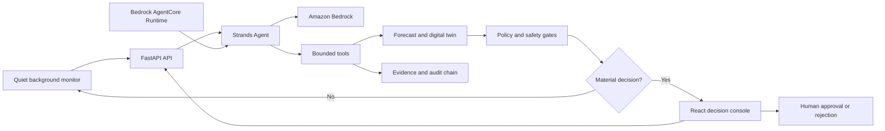

# SentinelOps HumanGuard

> A quiet professional agent that predicts operational incidents, evaluates safe interventions, and asks a human only when a consequential decision is ready.

SentinelOps HumanGuard targets the **Professional Agents** track of the AWS Agents for Humans Hackathon. It reduces the repetitive, judgment-heavy work of incident prevention for reliability and operations teams.

The system uses the **Strands Agents SDK** for agentic reasoning and tool orchestration, **Amazon Bedrock** as its managed model provider, and a deployable **Amazon Bedrock AgentCore Runtime** entrypoint. Its deterministic digital-twin engine remains the authority for forecasts, simulations, policy gates, and evidence verification.

> [!IMPORTANT]
> The agent prepares a decision brief but cannot deploy, scale, roll back, or change production infrastructure. A human approves or rejects every consequential recommendation.

## The problem and solution

Operations teams repeatedly collect telemetry, reconstruct an incident, test mitigations, check policy, and prepare a decision for an approver. HumanGuard handles that loop end to end:

1. Inspect operational state and collect evidence.
2. Forecast the likely bottleneck before customers experience it.
3. Build a bounded digital twin and simulate interventions.
4. Rank interventions and verify mandatory safety gates.
5. Produce one evidence-backed human decision brief.
6. Wait quietly unless a real decision is needed.

## Genuine Strands implementation

The Strands agent calls seven bounded tools:

| Strands tool | Real work performed |
|---|---|
| `inspect_operational_state` | Loads the workflow and current state |
| `collect_operational_evidence` | Collects and hashes decision evidence |
| `forecast_bottleneck` | Runs the deterministic forecast |
| `build_bounded_digital_twin` | Creates a workflow-scoped twin |
| `simulate_interventions` | Executes intervention simulations |
| `rank_and_verify_interventions` | Applies ranking and mandatory gates |
| `prepare_human_decision_brief` | Generates the final review package |

Tool calls are recorded in the tamper-evident audit timeline. The model may choose and explain work, but deterministic services own calculation and policy authority. No production-mutation tool is exposed.

## Architecture




See [the detailed AWS architecture](docs/AWS_STRANDS_ARCHITECTURE.md).

## AWS technology

- **Strands Agents SDK** — agent loop, instructions, and custom tools.
- **Amazon Bedrock** — managed model inference through the Strands Bedrock provider.
- **Amazon Bedrock AgentCore Runtime** — deployment entrypoint under `deploy/agentcore/`.
- **AWS IAM credential chain** — no secrets embedded in the application.
- **CloudWatch-compatible runtime** — managed runtime observability after AgentCore deployment.

AgentCore is deployment-ready but is not claimed as live until an authenticated deployment is completed and its ARN is recorded.

## Run locally

Prerequisites: Python 3.11+, Node.js 20+, pnpm, and optional AWS credentials with Bedrock model access.

```bash
cp .env.example .env
python -m venv .venv
source .venv/bin/activate
pip install -e '.[dev]'
uvicorn backend.app.main:app --reload --port 8000
```

On Windows PowerShell, activate with `.venv\Scripts\Activate.ps1`. In another terminal:

```bash
cd frontend
pnpm install
pnpm dev
```

Open `http://localhost:5173/judge-demo`.

### AWS configuration

```dotenv
SENTINELOPS_STRANDS_ENABLED=true
SENTINELOPS_STRANDS_OFFLINE_FALLBACK=true
SENTINELOPS_AWS_REGION=us-east-1
SENTINELOPS_BEDROCK_MODEL_ID=global.anthropic.claude-sonnet-4-6
SENTINELOPS_BACKGROUND_MONITOR_ENABLED=false
SENTINELOPS_BACKGROUND_MONITOR_INTERVAL_SECONDS=60
```

With valid AWS credentials, the API uses live Strands + Bedrock. Without credentials, the explicitly labelled offline fallback keeps the deterministic demo usable and never pretends a managed model ran.

### Invoke the agent

After seeding a demo workflow in the UI:

```bash
curl -X POST http://localhost:8000/api/v1/workflows/1/strands/invoke \
  -H 'Content-Type: application/json' \
  -d '{"objective":"Assess this workflow end to end and prepare a human decision brief."}'
curl http://localhost:8000/api/v1/strands/status
```

Run one quiet monitor tick with `curl -X POST http://localhost:8000/api/v1/strands/background/tick`.

## Deploy to AgentCore

The entrypoint is [deploy/agentcore/main.py](deploy/agentcore/main.py). Follow [the deployment guide](deploy/agentcore/README.md) after configuring AWS credentials and selecting an allowed Bedrock model. Deployment can create billable resources and is never performed automatically.

## Safety

- No production-action tool exists.
- Every tool is workflow-scoped and bounded.
- Forecasts and rankings are deterministic and reproducible.
- Recommendations must pass policy gates.
- Live and fallback modes are clearly distinguished.
- Material decisions always stop for a human.

## Verification

```bash
pytest -q
ruff check backend/app/strands_runtime backend/app/api/strands_routes.py deploy/agentcore/main.py backend/tests/test_strands_runtime.py
mypy backend/app/strands_runtime backend/app/api/strands_routes.py deploy/agentcore/main.py
bandit -q -r backend/app/strands_runtime backend/app/api/strands_routes.py deploy/agentcore
```

Current backend result: **96 tests passed**. The Strands SDK recognizes all seven custom tools by their intended public names.

## Submission assets

- [Devpost-ready description](docs/DEVPOST_SUBMISSION.md)
- [Five-minute demo script](docs/DEMO_SCRIPT_AGENTS_FOR_HUMANS.md)
- [AWS and Strands architecture](docs/AWS_STRANDS_ARCHITECTURE.md)
- [Final submission checklist](docs/SUBMISSION_CHECKLIST.md)
- [AgentCore deployment guide](deploy/agentcore/README.md)

## Prior-work disclosure

SentinelOps began as an operational digital-twin project. For this hackathon, the HumanGuard agent layer, Strands tools, Amazon Bedrock integration, quiet monitoring, AgentCore entrypoint, AWS architecture, and submission materials were added. This lets judges distinguish the new work from the prior foundation.

## License

[MIT](LICENSE) © Janice Benita.
