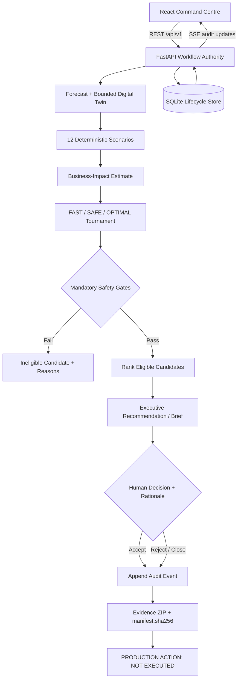

# SentinelOps Nexus: Product Requirements Document

> Status: **Finale Working Build**. SentinelOps Nexus is a bounded operational model with a tamper-evident SHA-256-linked audit chain. Cloud-dependent capabilities are classified in `integration-status-matrix.md`; configuration and diagrams are not deployment evidence.

Google-native extensions provide Gemini evidence reasoning, Gemma advisory policy review, ADK/A2A orchestration boundaries, an MCP gateway, Vertex supplemental forecasting, BigQuery schemas, Pub/Sub event contracts, Cloud Run packaging, trace metadata and OAuth2/JWT-ready service identity. Deterministic calculations and safety gates remain authoritative, with visible fallback state.

## 1. Document Control

| Field | Details |
| :--- | :--- |
| **Product** | SentinelOps Nexus |
| **Document** | Product Requirements Document (PRD) |
| **Version** | 1.0 |
| **Status** | Hackathon Submission Baseline |
| **Date** | 3 August 2026 |
| **Challenge** | B2B Services — Late Bottleneck Detection |
| **Author/Team** | SentinelOps Nexus Team |
| **Product Boundary** | Advisory decision-support and evidence system |
| **Safety Status** | `PRODUCTION ACTION: NOT EXECUTED` |

---

## 2. Executive Summary

SentinelOps Nexus is an evidence-first operational decision-support system designed to bridge the gap between technical telemetry and executive-level intervention. In modern enterprise environments, bottlenecks are often identified only after customer-facing Service Level Objectives (SLOs) are breached. SentinelOps Nexus shifts this paradigm by forecasting emerging constraints, simulating interventions in a bounded Digital Twin, and providing a governed, auditable path to a human decision.

The system ingests telemetry, generates a version-locked Digital Twin, executes 12 deterministic scenarios, and evaluates intervention candidates (FAST, SAFE, and OPTIMAL) against mandatory safety gates. It concludes by presenting an executive recommendation and recording a human decision with a mandatory rationale. Crucially, the system maintains a hard boundary: it does not execute production actions. It is a forensic and advisory tool that ensures every decision is backed by a tamper-evident SHA-256-linked audit chain and a comprehensive Evidence ZIP export.

---

## 3. Problem Statement

Enterprise operations teams face four critical challenges when managing high-scale services:

1.  **Reactive Bottleneck Detection:** Teams typically respond to saturation or latency issues only after they trigger alerts, leading to customer impact and financial loss.
2.  **Opaque Intervention Risks:** Choosing an intervention (e.g., scaling up vs. traffic shaping) often relies on operator intuition rather than deterministic simulation of "what-if" scenarios.
3.  **Governance Gaps:** High-stakes operational decisions often lack a unified audit trail that links the original telemetry, the simulated outcomes, the safety checks, and the human rationale.
4.  **Evidence Fragmentation:** Data required to justify an intervention is often scattered across monitoring tools, logs, and manual notes, making post-incident reviews difficult and non-reproducible.

---

## 4. Product Vision

To provide enterprise operations teams with a "flight simulator" for production interventions—enabling them to predict bottlenecks early, test solutions safely in a deterministic environment, and record governed decisions with forensic-grade evidence.

---

## 5. Goals

*   **Early Foresight:** Identify resource saturation (e.g., Redis memory pressure) before it impacts customer transactions.
*   **Deterministic Reliability:** Ensure that replaying the same scenario with the same inputs always yields the same result hash.
*   **Safety-First Governance:** Implement mandatory safety gates that disqualify unsafe interventions regardless of their performance score.
*   **Forensic Auditability:** Generate a tamper-evident audit chain linking every stage of the decision lifecycle.
*   **Human Accountability:** Require explicit human rationale for every decision, whether accepting or rejecting a recommendation.

---

## 6. Non-Goals

*   **Automated Execution:** The system will not scale, deploy, or modify production infrastructure.
*   **Live Production Replica:** The Digital Twin is a bounded model, not a 1:1 mirror of the entire production environment.
*   **Universal Prediction:** The system does not claim to predict all failure modes, only those modeled within the deterministic scenarios.
*   **Real-time Telemetry Ingestion:** The submitted build focuses on seeded and uploaded JSON telemetry for demonstration.
*   **AI Autonomy:** The system does not allow AI agents to make or execute decisions without human oversight.

---

## 7. Target Users and Stakeholders

*   **SRE (Site Reliability Engineering) Leads:** Primary users who analyze bottlenecks and evaluate intervention strategies.
*   **Platform Engineers:** Users who configure the Digital Twin boundaries and scenario parameters.
*   **Operations Managers:** Stakeholders who review the Executive Brief to understand business impact and risks.
*   **Compliance/Audit Officers:** Stakeholders who utilize the Evidence ZIP to verify that operational procedures were followed.

---

## 8. Primary User Journey

1.  **Observation:** The user views the Command Centre, where seeded Payment Service telemetry indicates rising traffic and Redis memory pressure.
2.  **Forecasting:** The system generates a bounded forecast showing a modeled safe-capacity crossing time.
3.  **Simulation:** The system creates a version-locked Digital Twin and automatically executes 12 deterministic scenarios to test system resilience.
4.  **Tournament:** The user initiates an Intervention Tournament comparing FAST, SAFE, and OPTIMAL strategies.
5.  **Review:** The user reviews the Executive Brief, noting that the FAST candidate was disqualified by Mandatory Safety Gates.
6.  **Decision:** The user records a decision (Accept or Reject) and provides a mandatory rationale.
7.  **Audit & Export:** The system appends a SHA-256-linked audit event and enables the Evidence ZIP export.
8.  **Conclusion:** The journey ends. Any subsequent operational activity occurs outside SentinelOps Nexus through separate, authorized channels.

---

## 9. Current Working-Build Scope

The submitted build is a deterministic working demonstration. It includes:
*   A React 18 frontend "Command Centre."
*   A FastAPI backend providing versioned `/api/v1` routes.
*   A Python-based deterministic simulation engine.
*   A SQLite persistence layer for the complete workflow lifecycle.
*   Seeded Payment Service data demonstrating a Redis saturation event.

---

## 10. Implemented Capabilities versus Future Evolution

| Feature | Implemented (Build 1.0) | Future Evolution |
| :--- | :--- | :--- |
| **Telemetry** | Seeded JSON / Manual Upload | Live streaming (gRPC/Prometheus) |
| **Simulation** | Deterministic Python Logic | Higher-fidelity validated simulation |
| **Persistence** | Local SQLite | Durable distributed persistence |
| **Policy** | Hard-coded Safety Gates | Externally managed policy evaluation |
| **Identity** | Session-based / Named Input | Enterprise SSO / RBAC |
| **Action** | `NOT EXECUTED` Boundary | Separately governed integration research |

---

## 11. Functional Requirements

| ID | Title | Requirement | Rationale | Acceptance Criteria |
| :--- | :--- | :--- | :--- | :--- |
| **FR-01** | Seeded Telemetry | Load canonical Payment Service telemetry. | Provides a baseline for the demonstration. | UI displays seeded Redis and traffic metrics on load. |
| **FR-02** | JSON Upload | Support manual JSON telemetry upload. | Allows users to test the system with custom data. | API accepts valid JSON; UI updates metrics accordingly. |
| **FR-03** | Schema Validation | Validate all inputs via Pydantic. | Ensures data integrity and prevents malformed processing. | Invalid JSON returns a 422 Unprocessable Entity error. |
| **FR-04** | Workflow Identity | Create versioned workflow IDs. | Enables tracking of unique decision cycles. | Every new session generates a unique UUID. |
| **FR-05** | Bounded Forecast | Generate a linear saturation forecast. | Predicts when resources will hit limits. | Forecast line is visible in the UI charts. |
| **FR-06** | Capacity Crossing | Identify safe-capacity crossing time. | Provides a specific target for intervention. | System calculates crossing time based on disclosed assumptions. |
| **FR-07** | Impact Timing | Estimate customer-impact timing. | Quantifies the urgency of the bottleneck. | UI shows a "Modeled Impact" timestamp. |
| **FR-08** | Assumption Disclosure | List forecast assumptions/limitations. | Ensures transparency in the advisory model. | Forecast view includes a "Method & Assumptions" section. |
| **FR-09** | Digital Twin Creation | Generate a bounded Digital Twin. | Isolates the variables relevant to the bottleneck. | Twin manifest is generated and viewable in JSON format. |
| **FR-10** | Version-Locked Twin | Treat manifests as version-locked. | Prevents silent changes to the simulation base. | Changed inputs trigger a new manifest and hash. |
| **FR-11** | Stable Seed | Use a fixed seed for simulations. | Ensures deterministic, repeatable results. | Re-running a scenario yields identical output values. |
| **FR-12** | 12-Scenario Suite | Execute all 12 defined scenarios. | Provides a comprehensive stress test of the Twin. | Workflow progress shows 12/12 scenarios completed. |
| **FR-13** | Scenario Inspection | Inspect scenario inputs and controls. | Allows users to verify simulation parameters. | Clicking a scenario reveals its specific control set. |
| **FR-14** | Result Hashing | Generate reproducible SHA-256 hashes. | Verifies the integrity of simulation outputs. | Each scenario result includes a content-based hash. |
| **FR-15** | Candidate Construction | Build FAST, SAFE, and OPTIMAL candidates. | Offers a range of intervention strategies. | Tournament view displays three distinct candidates. |
| **FR-16** | Safety Gate Evaluation | Evaluate candidates against safety gates. | Prevents unsafe recommendations. | System logs "Pass/Fail" for each gate per candidate. |
| **FR-17** | Immediate Disqualification | Exclude failed candidates from ranking. | Enforces the "Eligibility overrides score" rule. | Failed candidates are labeled "Ineligible." |
| **FR-18** | Eligible Ranking | Rank only eligible candidates. | Focuses the user on safe options. | Recommendations are limited to gate-eligible candidates. |
| **FR-19** | Impact Estimation | Estimate business exposure. | Connects technical risk to financial/user risk. | UI displays estimated exposure with assumptions. |
| **FR-20** | Executive Brief | Recommend highest-ranked eligible candidate. | Provides a clear summary for decision-makers. | Brief highlights the top-ranked safe candidate. |
| **FR-21** | Decision Submission | Capture human decision (Accept/Reject). | Marks the end of the advisory workflow. | UI provides "Accept" and "Reject/Close" buttons. |
| **FR-22** | Mandatory Rationale | Require rationale for all decisions. | Ensures accountability for the human action. | Submission is blocked until text is entered in rationale. |
| **FR-23** | Linked Audit Event | Append an append-only audit event. | Creates a tamper-evident record of the decision. | Audit log shows the decision, rationale, and hash. |
| **FR-24** | Evidence ZIP | Generate ZIP after human decision. | Provides a portable forensic package. | "Download Evidence" button activates after decision. |
| **FR-25** | Manifest Verification | Generate `manifest.sha256`. | Allows verification of the export package. | ZIP contains a valid SHA-256 manifest file. |
| **FR-26** | SQLite Persistence | Store lifecycle in SQLite. | Ensures data survives session refreshes. | Workflow state is retrievable from the local database. |
| **FR-27** | REST API | Expose versioned `/api/v1` routes. | Standardizes communication with the UI. | API documentation (Swagger) is accessible. |
| **FR-28** | SSE Updates | Provide real-time audit updates via SSE. | Keeps the UI in sync with backend events. | UI audit timeline updates without manual refresh. |
| **FR-29** | Guided Demo | Provide a deterministic demo mode. | Enables evaluation without external keys. | Demo runs successfully without paid AI credentials. |
| **FR-30** | Advisory Boundary | Maintain no-execution status. | Ensures the system remains a safety tool. | No scaling/deployment endpoints exist in the code. |

---

## 12. Non-Functional Requirements

| ID | Title | Acceptance Criteria |
| :--- | :--- | :--- |
| **NFR-01** | Reproducibility | Replaying a workflow with identical inputs must produce identical SHA-256 hashes for all artifacts. |
| **NFR-02** | Audit Integrity | Modification of any linked audit event must result in a hash-chain verification failure. |
| **NFR-03** | Explainability | All forecasts and impact estimates must display the underlying equations and assumptions. |
| **NFR-04** | Safety Isolation | The application must not contain any logic capable of calling cloud provider scaling or deployment APIs. |
| **NFR-05** | Local Capability | The system must be fully functional in a local environment using the deterministic provider. |
| **NFR-06** | API Validation | 100% of incoming REST requests must be validated against Pydantic schemas before processing. |
| **NFR-07** | Error Transparency | Errors must return descriptive messages and be recorded in the application logs. |
| **NFR-08** | Testability | The repository must include automated tests for the core simulation and audit logic. |
| **NFR-09** | Performance | The deterministic simulation of 12 scenarios must complete within a reasonable timeframe for a demo. |
| **NFR-10** | Usability | The Command Centre must be responsive and usable on standard desktop resolutions (1920x1080). |

---

## 13. Data and Input Requirements

The system requires structured telemetry data in JSON format.
*   **Metrics:** Redis memory utilization (percentage), Request rate (RPS), Latency (ms), Error rate (%).
*   **Topology:** Service name, dependency mapping (e.g., Payment Service -> Redis).
*   **Constraints:** Configured safe-capacity limits, replica counts, and timeout thresholds.

---

## 14. Forecasting Method and Assumptions

The system utilizes a bounded linear saturation model for the demonstration:
`utilization(t) = current_utilization + (growth_rate * t)`

*   **safe_threshold:** Configured safe-capacity limit supplied by the validated workflow configuration and disclosed with the forecast.
*   **Assumptions:** Growth is linear; no sudden traffic spikes occur outside modeled scenarios; dependency performance remains constant unless modified by a scenario.
*   **Canonical Demo:** Safe-capacity crossing is modeled at approximately `+30 minutes`; customer impact at `+45 minutes`.

---

## 15. Bounded Digital Twin Requirements

The Digital Twin is a version-locked representation of the Payment Service environment.
*   **Scope:** Limited to traffic, application replicas, and Redis cache state.
*   **Version Locking:** Once created, the workflow treats the manifest as version-locked. Changed inputs create a new manifest and content hash; the submitted workflow does not edit the existing manifest in place.
*   **Hashing:** The manifest is hashed using SHA-256 to ensure the simulation base is identifiable and verifiable.

---

## 16. Deterministic Scenario Catalogue

| ID | Purpose | Controlled Change | Inspected Output | Expected Behaviour |
| :--- | :--- | :--- | :--- | :--- |
| **1** | Baseline Growth | Linear traffic increase | Redis Memory | Gradual saturation |
| **2** | Redis Crash | Set Redis availability to 0 | Error Rate | Immediate error spike |
| **3** | Redis Latency | Increase Redis response time | P95 Latency | Latency degradation |
| **4** | Replica Failover | Remove one app replica | CPU/Memory per node | Increased load on remaining nodes |
| **5** | 10x Traffic | Multiply RPS by 10 | All metrics | Rapid saturation/failure |
| **6** | 1M User Stress | Set traffic to extreme load | System Stability | Modeled collapse point |
| **7** | Reduced Redis | Lower Redis memory limit | Saturation Time | Earlier crossing point |
| **8** | Increased Replicas | Add app replicas | Latency | Minimal impact on Redis bottleneck |
| **9** | Rollback | Revert to previous config | Metric recovery | Modeled recovery curve |
| **10** | Rate Limiting | Apply 50% throttle | Error Rate vs Latency | Reduced load, increased 429s |
| **11** | Cache Policy | Optimize TTLs | Memory growth rate | Slower saturation |
| **12** | Config Drift | Predefined config variation | Stability | Unexpected performance variance |

---

## 17. Intervention Tournament and Safety Policy

**Governance Rule:** Eligibility overrides score. A candidate that fails any mandatory safety gate cannot be ranked or recommended.

| Candidate | Intent | Expected Benefit | Operational Trade-off | Safety Gate | Eligibility | Ranking | Recommendation |
| :--- | :--- | :--- | :--- | :--- | :--- | :--- | :--- |
| **FAST** | Scale App | Quick capacity increase | High cost, ignores Redis | Failover Check | Ineligible | Excluded | Not Recommended |
| **SAFE** | Throttling | Immediate load reduction | Dropped requests | Pass | Eligible | Ranked | Compared |
| **OPTIMAL** | Redis + TTL | Targeted fix | Slower to implement | Pass | Eligible | Ranked | Recommended* |

*\*Recommended in the canonical demonstration. Outcomes apply to the canonical seeded workflow; other inputs may produce different results.*

---

## 18. Business-Impact Estimation

The system calculates exposure based on:
*   **Transaction Volume:** Modeled throughput during the impact window.
*   **Assumed Value:** A fixed placeholder value per transaction.
*   **Assumptions:** 100% of transactions fail after the impact threshold; no partial recovery is modeled.
*   **Disclaimer:** This is a heuristic estimate for decision support, not a financial guarantee.

---

## 19. Human Decision and Governance

The workflow terminates at the Human Decision Boundary.
*   **Accept Recommendation:** User agrees with the highest-ranked eligible candidate.
*   **Reject / Close:** User disagrees or chooses to take no action.
*   **Rationale:** A mandatory text field for both outcomes.
*   **Audit:** Both outcomes trigger a SHA-256 audit event and enable evidence export.

---

## 20. Audit Chain and Evidence Package

The Evidence ZIP contains 19 items to ensure full traceability:
1. Workflow record
2. Source telemetry
3. Validation result
4. Forecast and assumptions
5. Bounded Twin manifest
6. Twin content hash
7. 12 scenario inputs
8. 12 scenario results
9. Scenario hashes
10. Tournament results
11. Gate results
12. Ineligible reasons
13. Eligible ranking
14. Business-impact estimate
15. Executive recommendation
16. Human decision/rationale/reviewer
17. Audit event chain
18. Package-Generation Timestamp
19. Application/API Version or Git Commit Identifier

**Verification Note:** `manifest.sha256` verifies exported-file integrity. The linked audit chain verifies event sequence and detects modification of linked audit events. These are complementary but distinct controls; neither constitutes a digital signature, certified immutable storage, or legal non-repudiation.

---

## 21. System Architecture

---

## 22. API and Communication Requirements

*   **Protocol:** REST for commands; SSE for audit updates.
*   **Versioning:** All routes prefixed with `/api/v1`.
*   **Validation:** Pydantic validates structure, types, and configured constraints but is not complete protection against all application-security threats.

---

## 23. Persistence Model

*   **Technology:** SQLite.
*   **Role:** Authoritative workflow store for the deterministic demonstration.
*   **Data Stored:** Workflows, manifests, forecasts, scenario results, tournament outcomes, gate results, recommendations, human decisions, and the audit chain.

---

## 24. Security, Privacy and Compliance Boundaries

*   **Implemented Controls:** Pydantic validation, backend-owned state transitions, SHA-256 audit linking, and the advisory-only boundary.
*   **Privacy:** No private chain-of-thought capture; only inputs, outputs, assumptions, evidence references, hashes, transitions, gate results, recommendations, decisions, and rationales are recorded.
*   **Compliance:** The submitted build is not represented as certified or compliant with any external regulatory framework (SOC2, GDPR, etc.).

---

## 25. Error Handling and Failure Behaviour

*   **Validation Errors:** Returned transparently to the UI with 4xx status codes.
*   **State Errors:** Backend prevents invalid transitions (e.g., exporting evidence before a decision).
*   **Audit Failures:** Material workflow failures are recorded as audit events where implemented; ordinary application logs are not represented as part of the cryptographic decision chain.

---

## 26. Evaluation and Success Criteria

*   **Canonical Success:** The seeded workflow completes from ingestion to evidence export.
*   **Deterministic Stability:** Re-running the demo produces identical hashes.
*   **Safety Enforcement:** FAST is correctly disqualified in the seeded demo.
*   **Audit Integrity:** The Evidence ZIP contains all 19 required items and passes manifest verification.

---

## 27. Testing Strategy

*   **Unit Tests:** Focus on the forecasting logic and SHA-256 hashing.
*   **Integration Tests:** Verify the FastAPI routes and SQLite persistence.
*   **E2E Tests:** Validate the complete user journey from Command Centre to Evidence Export.
*   **Security:** Static analysis of Python code for common vulnerabilities.

---

## 28. Risks and Mitigations

| Risk | Mitigation |
| :--- | :--- |
| Seeded data mistaken for live data | Prominent "Deterministic Demo" labeling in the UI. |
| Bounded Twin mistaken for perfect replica | Explicit "Bounded Model" disclaimer in the Twin view. |
| Heuristic forecast mistaken for prediction | Forecasting method, assumptions, and deterministic disclaimer disclosed. |
| Impact estimate mistaken for savings | Labeled as "Estimate" with visible placeholder variables. |
| Recommendation mistaken for execution | Persistent `PRODUCTION ACTION: NOT EXECUTED` footer. |
| Hash linking mistaken for immutable storage | Technical documentation clarifying SHA-256 vs. certified storage. |
| SQLite limitations | Documented as a demo-only persistence layer. |
| Optional AI authority | Narrative adapter restricted to text generation; no state control. |
| Roadmap features mistaken for implemented | Clear "Future Evolution" section in the PRD. |

---

## 29. Limitations and Explicit Non-Claims

*   No validated universal forecast accuracy.
*   No guaranteed financial benefit.
*   No durable distributed production persistence.
*   No certified immutable storage.
*   No verified Vertex AI call, BigQuery write, Pub/Sub delivery, official ADK execution, OTLP export, or Cloud Run deployment in this branch.
*   Gemini has a credentialed API path and Gemma has a remote policy path, but neither is marked verified without successful invocation evidence.
*   A2A persistence, authenticated MCP tools, and deterministic local fallbacks are the locally verified integration scope.
*   No production-action execution endpoint.

---

## 30. Delivery Acceptance Criteria

1.  Repository starts using documented commands.
2.  Guided Demo completes without paid credentials.
3.  All 12 deterministic scenarios execute.
4.  Safety gates precede ranking and recommendation.
5.  Both human outcomes are audited and exportable.
6.  Export verification succeeds and tampering is detectable.
7.  Automated tests pass using documented commands.
8.  UI and evidence artifacts visibly state `PRODUCTION ACTION: NOT EXECUTED`.

---

## 31. Roadmap

*   **Phase 1:** Submitted deterministic working build.
*   **Phase 2:** Pilot telemetry adapters, durable persistence, and enterprise identity.
*   **Phase 3:** Multi-service topology and production observability integration.
*   **Phase 4:** Separately Governed Integration Research: Evaluate narrowly scoped integrations only after independent authorization, RBAC, rollback safeguards, security review, and operational validation. This capability is not part of the submitted build, and the submitted application contains no production-action execution endpoint.

---

## 32. Glossary

*   **Digital Twin:** A version-locked, bounded model of specific system variables.
*   **Mandatory Gate:** A safety check that must be passed for eligibility.
*   **Audit Chain:** A sequence of events linked by SHA-256 hashes.
*   **Tournament:** The process of comparing multiple intervention candidates.

---

## 33. Final Product Boundary

SentinelOps Nexus is an advisory system. It provides the evidence and the governance framework required for a human to make a high-stakes decision. It does not replace the human, nor does it interact with the production environment.

> **PRODUCTION ACTION: NOT EXECUTED**
>
> SentinelOps Nexus records a governed human decision and preserves its supporting evidence. The submitted build does not deploy, scale, roll back, reconfigure or otherwise modify production infrastructure.
