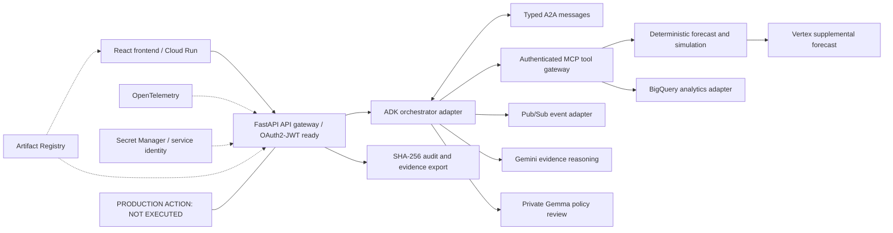
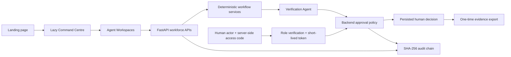

# SentinelOps Nexus Architecture

The full human-authored architecture board is available as a [single-page PDF](assets/sentinelops-nexus-architecture.pdf). The Mermaid diagrams below remain the repository-native, reviewable source of truth; managed-service runtime claims are governed by the [runtime evidence index](runtime-evidence-index.md).

## Google-native target boundary

AI Studio is prompt-development tooling, not runtime. Models remain advisory; deterministic gates, workflow state and human authorization are authoritative. No production execution endpoint exists.

## Secure workforce upgrade

The landing route loads independently. Lazy frontend routes call strict FastAPI v1 endpoints. Workforce executions, verification results, role checks and human decisions are persisted and linked to the chained audit log. No layer contains a production execution adapter.

SentinelOps Nexus is an evidence-driven Enterprise Operational Digital Twin. Its primary path is predictive: observe, correlate, forecast, simulate, compare, explain, and stop for human approval.

## Components

- FastAPI provides validated prediction and simulation contracts.
- The deterministic capacity model creates reproducible seeded forecasts.
- Nine specialised agents expose typed, evidence-linked hand-offs.
- The Digital Twin manifest hashes telemetry and configuration and fixes the seed and network policy.
- The chaos matrix applies identical conditions to Baseline, Fast, Safe, and Optimal strategies.
- Mandatory gates decide eligibility before transparent scoring.
- React presents Time Travel, evidence, agent trace, business impact, tournament, and approval views.
- The inherited reactive investigation workflow remains available as a secondary compatibility path.

No LLM controls state transitions, approval, or production execution. A2A persistence and the authenticated MCP gateway are locally verified. Gemini Enterprise Agent Platform (formerly Vertex AI) and Gemma have credentialed call paths with explicit fallbacks. ADK remains a local adapter. Physical BigQuery DDL and Pub/Sub provisioning/smoke tooling require authenticated execution; exported OpenTelemetry traces, Cloud Run and service IAM are not verified in the current public deployment. Antigravity has a typed read-only provider boundary and deterministic fallback, but official participant documentation, SDK, endpoint, and access are unavailable (`BLOCKED_BY_PARTICIPANT_ACCESS`).

See the large Mermaid diagram in the repository README.
